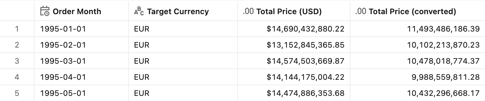
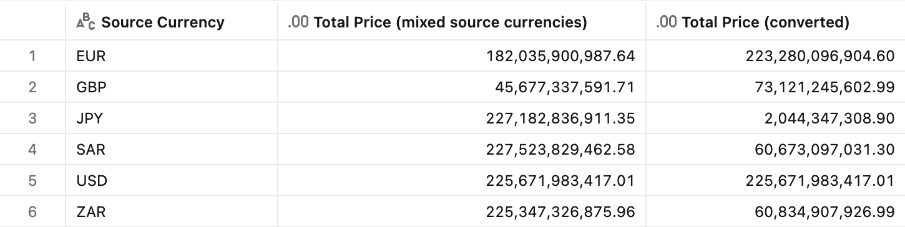
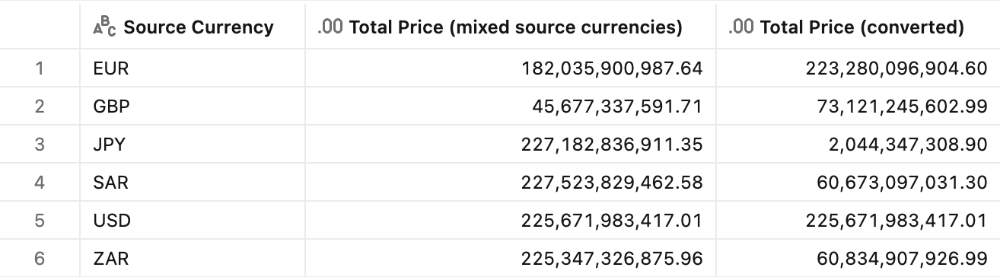

# :currency_exchange: Currency conversion

## Introduction

Multinational businesses record transactions in many currencies but need to report them in a single, comparable currency chosen by whoever is looking at the report. Sales booked in euros, pounds, and yen all have to be restated into, say, US dollars before they can be summed into a meaningful total, and the "right" answer depends on *which* reporting currency and *which* exchange rate series (a period-average rate for the income statement, an end-of-period spot rate for the balance sheet) the reader wants.

Unity Catalog semantics solves this with [**parameters**](https://docs.databricks.com/gcp/en/uc-semantics/metric-views/use-parameters): named, typed values that the consumer supplies *at query time*. The parameter is referenced by bare name inside field, measure, filter, or join expressions, and bound in the `FROM` clause as `metric_view(param => value)`. A single metric view can expose a `p_target_currency` (and, if needed, a rate type) parameter, and every measure re-converts on the fly: no separate view per currency, and one governed definition shared consistently across Databricks SQL, AI/BI dashboards, Genie, and BI clients.

> [!NOTE]
> Every parameter in this pattern is prefixed with `p_` (`p_target_currency`, `p_rate_type`). The prefix is a convention that keeps parameter names from colliding with column names of the same meaning; see the [rate type warning](#multiple-sources-targets-and-rate-types) below for a concrete case where an unprefixed name silently breaks a join.

This pattern covers three scenarios:

| # | Case | Parameters |
| - | ---- | ---------- |
| A | [Single source currency, multiple targets](#single-source-currency-multiple-targets) | `p_target_currency` |
| B | [Multiple source currencies, multiple targets](#multiple-source-currencies-multiple-targets) | `p_target_currency` |
| C | [Multiple sources, targets and rate types](#multiple-sources-targets-and-rate-types) | `p_target_currency`, `p_rate_type` |

## Preparation

1. Ensure that you have created the test dataset using the [tpc-h.sql](/tpc-h.sql) script.

2. Create the synthetic data using the [currency-conversion.sql](./currency-conversion.sql) script. TPC-H has no exchange-rate table, so this script adds two tables.
    <details>
    <summary>What the script creates</summary>

    **`exchange_rate`** table, at grain **(rate_type, from_currency, to_currency, rate_month)**:

    | Column | Meaning |
    | ------ | ------- |
    | `rate_type` | `AVG` (period average) or `EOP` (end-of-period / spot) |
    | `from_currency` | source currency (USD, EUR, GBP, JPY, ZAR, SAR) |
    | `to_currency` | target currency (USD, EUR, GBP, JPY, ZAR, SAR) |
    | `rate_month` | first day of the month the rate applies to |
    | `rate` | units of `to_currency` per **1** unit of `from_currency`, so `converted = amount * rate` |

    Rates are **real historical data** from the US Federal Reserve H.10 release (via the public [`datasets/exchange-rates`](https://github.com/datasets/exchange-rates) dataset), hardcoded as `VALUES` and covering **1992-01 through 1998-12**, the full TPC-H `orders` date range. The script stores one real *units-per-USD* factor per currency and month (`AVG` from the monthly average, `EOP` from the last daily observation of the month), then derives the `rate` for **every currency pair** by **triangulation** (`rate = to_factor / from_factor`). This keeps the input to real published per-USD rates and guarantees triangular consistency. Identity rows (`from_currency = to_currency`) always have `rate = 1`, and because the factor table spans the full `orders` range, **every order month has a matching rate** (no gaps).

    Two currencies need a note:
    - **EUR** did not exist before 1999, so it is proxied by the **German Mark**: `EUR/USD = (DEM per USD) / 1.95583` (the irrevocable euro conversion rate). DEM has no daily series, so **EUR `EOP` = EUR `AVG`**.
    - **SAR** has been hard-pegged to the USD at **3.75** since 1986, so **SAR `AVG` = SAR `EOP` = 3.75**.

    **`orders_currency`**, the `orders` table (one row per order) enriched with a `source_currency` column mapped from the customer's **TPC-H region** via the standard join path `orders → customer → nation → region`. Each region maps to one currency, with the United Kingdom carved out to GBP:

    | TPC-H region | Currency |
    | ------------ | -------- |
    | AMERICA | USD |
    | EUROPE | EUR *(UNITED KINGDOM → GBP)* |
    | ASIA | JPY |
    | AFRICA | ZAR |
    | MIDDLE EAST | SAR |

    Cases B and C read this column instead of deriving the currency inline.
    </details>

3. Because the pattern converts `o_totalprice`, Case A uses `orders` as the base and treats every order as USD. Cases B and C use `orders_currency`, where each order's **source currency** is mapped from the customer's region (see above); `o_totalprice` is treated as being denominated in that source currency (a demo convenience, since TPC-H prices are really all in one currency).

> [!NOTE]
> The converted measures use `format: type: number`, not `type: currency`. A currency format block hard-codes a single `currency_code`, but here the reporting currency is chosen at query time. The active currency is surfaced through the `Target Currency` field instead.


## Single source currency, multiple targets

**Sample question** - *All our sales are booked in USD. What is the monthly revenue restated in a reporting currency the user picks?*

Every order is in USD, so we join to the exchange rate for `from_currency = 'USD'` and the parameter-supplied `p_target_currency`. The full primary key of `exchange_rate` is pinned in the join condition, so exactly one rate row matches each order month and the sum stays correct without any de-duplication.

### Measure definition

```yaml
parameters:
  - name: p_target_currency
    display_name: Target Currency
    comment: Reporting currency the amounts are converted into (USD, EUR, GBP, JPY, ZAR, SAR)
    data_type: STRING
    default: "'EUR'"

joins:
  - name: fx
    source: exchange_rate
    'on': >
      fx.rate_month = DATE_TRUNC('month', source.o_orderdate)
      AND fx.from_currency = 'USD'
      AND fx.to_currency = p_target_currency
      AND fx.rate_type = 'AVG'
    rely:
      at_most_one_match: true

# ...

- name: TotalPriceConverted
  display_name: Total Price (converted)
  comment: Total order price converted from USD to the selected p_target_currency at that month's AVG rate
  expr: SUM(o_totalprice * fx.rate)
  format:
    type: number
    decimal_places:
      type: exact
      places: 2
    hide_group_separator: false
    abbreviation: none
```

> [!NOTE]
> A string parameter's `default` must be a constant SQL expression, so a literal string is **SQL-quoted inside the YAML scalar**: `default: "'EUR'"` (not `default: EUR`).

### Test query

Pass the parameter with the `name => value` syntax in the `FROM` clause:

```sql
SELECT Month, TargetCurrency, AGG(TotalPriceUSD), AGG(TotalPriceConverted)
FROM mv_currencyconversionsinglesource(p_target_currency => 'EUR')
WHERE Month BETWEEN '1995-01-01' AND '1995-05-01'
GROUP BY ALL
ORDER BY Month
```

<details>
<summary>Test query output</summary>



</details>

> [!TIP]
> Query with `p_target_currency => 'USD'` as a self-check: the converted total equals the USD total exactly, because the identity rate is 1.


## Multiple source currencies, multiple targets

**Sample question** - *Our orders are booked in different currencies depending on the customer. What is total revenue restated into one reporting currency the user picks?*

Now the source currency varies per order. Rather than deriving it inside the view, each order's source currency is pre-assigned in the `orders_currency` table by region (see [Preparation](#preparation)), so the view simply uses `orders_currency` as its source and reads the `source_currency` column. The `fx` join then matches on that column plus the parameter-supplied `p_target_currency`.

### Measure definition

```yaml
source: orders_currency

parameters:
  - name: p_target_currency
    data_type: STRING
    default: "'USD'"

joins:
  - name: fx
    source: exchange_rate
    'on': >
      fx.rate_month = DATE_TRUNC('month', source.o_orderdate)
      AND fx.from_currency = source.source_currency
      AND fx.to_currency = p_target_currency
      AND fx.rate_type = 'AVG'
    rely:
      at_most_one_match: true

# ...

- name: TotalPriceConverted
  display_name: Total Price (converted)
  comment: Each order converted from its own source currency to p_target_currency, then summed
  expr: SUM(o_totalprice * fx.rate)
```

### Test query

```sql
SELECT SourceCurrency, AGG(TotalPriceSource), AGG(TotalPriceConverted)
FROM mv_currencyconversionmultiSource(p_target_currency => 'USD')
GROUP BY ALL
ORDER BY SourceCurrency
```

<details>
<summary>Test query output</summary>



</details>

> [!NOTE]
> With `p_target_currency => 'USD'`, the `USD` row is unchanged (USD→USD rate 1), while `JPY` shrinks about 100–130× (JPY→USD ≈ 1/120 over 1992–1998) and `SAR` shrinks 3.75× (its USD peg). This is arithmetically correct and is exactly the point of currency normalization: amounts that look comparable in mixed source currencies are not comparable until restated in one currency.


## Multiple sources, targets and rate types

**Sample question** - *Same as above, but let the user also choose the exchange-rate series: a period-average rate or an end-of-period spot rate.*

This adds a second parameter for the rate type. The `exchange_rate` table already carries both an `AVG` and an `EOP` series per month, so we only need to select one at query time.

### Measure definition

```yaml
parameters:
  - name: p_target_currency
    data_type: STRING
    default: "'USD'"
  - name: p_rate_type
    display_name: Exchange Rate Type
    comment: Which exchange-rate series to use - AVG (period average) or EOP (end of period / spot)
    data_type: STRING
    default: "'AVG'"

joins:
  - name: fx
    source: exchange_rate
    'on': >
      fx.rate_month = DATE_TRUNC('month', source.o_orderdate)
      AND fx.from_currency = source.source_currency
      AND fx.to_currency = p_target_currency
      AND fx.rate_type = p_rate_type
    rely:
      at_most_one_match: true
```

> [!WARNING]
> The rate-type parameter is named **`p_rate_type`, not `rate_type`**. `exchange_rate` has a `rate_type` column, so a bare `rate_type` in the join `on` clause would be ambiguous and resolve to the column, turning the predicate into `fx.rate_type = fx.rate_type` (always true). Both rate types would then match, doubling the join fanout and silently inflating every sum. A distinct parameter name avoids the collision; always qualify the column as `fx.rate_type`.

### Test query

Pass the rate type alongside the target currency in the `FROM` clause:

```sql
SELECT SourceCurrency, AGG(TotalPriceSource), AGG(TotalPriceConverted)
FROM mv_currencyconversionmultiratetype(p_target_currency => 'USD', p_rate_type => 'AVG')
GROUP BY ALL
ORDER BY SourceCurrency
```

<details>
<summary>Test query output</summary>



</details>


## End-to-end templates

The end-to-end reference implementations can be found in these YAML files:

- [Single source currency](./Single%20source%20currency.yml): `mv_CurrencyConversionSingleSource`
- [Multiple source currencies](./Multiple%20source%20currencies.yml): `mv_CurrencyConversionMultiSource`
- [Multiple exchange rate types](./Multiple%20exchange%20rate%20types.yml): `mv_CurrencyConversionMultiRateType`
