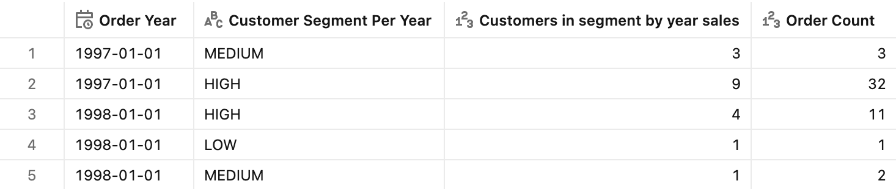
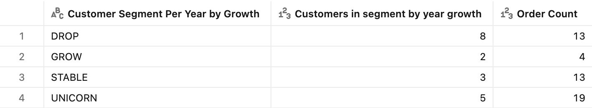
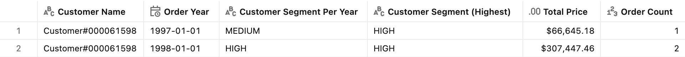

# :bar_chart: Dynamic segmentation

## Introduction

The Dynamic segmentation pattern is useful for classifying entities based on measures. A typical example is a **loyalty program**: members are graded into tiers based on spend, and the grading is re-run continuously. The clustering is dynamic, so that the categorization considers the filters and groupings active in the query. Indeed, a customer might belong to different clusters on different dates.

- **This year's tier** — grade every member LOW / MEDIUM / HIGH by their spend *this year*, so a member can be **promoted or demoted** year over year.
- **Trajectory** — label members by how their spend is *moving* (dropping, stable, growing, or an exploding "unicorn") to find at-risk and rising accounts.
- **Lifetime status** — give each member the **best tier they have ever reached**, the way an airline grants lifetime status, counted once regardless of the year.

The pattern classifies entities — here, customers — into segments based on a **measure that is computed at query time**, so an entity's segment is *not* stored on a row; it is re-derived for whatever the query filters and groups by. This is the counterpart of [Static segmentation](../Static%20segmentation/), where the band is a fixed attribute decided once.


## Preparation

1. Ensure that you have created the test dataset using the [tpc-h.sql](/tpc-h.sql) script.

2. Create the basic metric view definition.
    <details>
    <summary>Basic metric view definition</summary>

    ```yaml
    version: 1.1
    comment: Unity Catalog semantics patterns

    source: orders

    joins:
      - name: customer
        source: customer
        'on': source.o_custkey = customer.c_custkey
        rely:
          at_most_one_match: true
        joins:
          - name: nation
            source: nation
            'on': customer.c_nationkey = nation.n_nationkey
            rely:
              at_most_one_match: true
            joins:
              - name: region
                source: region
                'on': nation.n_regionkey = region.r_regionkey
                rely:
                  at_most_one_match: true

    fields:
      - name: RegionName
        display_name: Region Name
        expr: customer.nation.region.r_name

      - name: CountryName
        display_name: Country Name
        expr: customer.nation.n_name

      - name: CustomerName
        display_name: Customer Name
        expr: customer.c_name

      - name: MarketSegment
        display_name: Market Segment
        expr: customer.c_mktsegment

      - name: OrderDate
        display_name: Order Date
        expr: o_orderdate
        format:
          type: date
          date_format: year_month_day
          leading_zeros: true

      - name: Year
        display_name: Order Year
        expr: "DATE_TRUNC('year', o_orderdate)"
        format:
          type: date
          date_format: year_month_day
          leading_zeros: true

      - name: Month
        display_name: Order Month
        expr: "DATE_TRUNC('month', o_orderdate)"
        format:
          type: date
          date_format: year_month_day
          leading_zeros: true

      - name: Quarter
        display_name: Order Quarter
        expr: "DATE_TRUNC('quarter', o_orderdate)"
        format:
          type: date
          date_format: year_month_day
          leading_zeros: true

      - name: OrderPriority
        display_name: Order Priority
        expr: o_orderpriority

      - name: ShipPriority
        display_name: Ship Priority
        expr: o_shippriority

    measures:
      - name: TotalPrice
        display_name: Total Price
        comment: Sum of o_totalprice across all orders in the period
        expr: SUM(o_totalprice)
        format:
          type: currency
          currency_code: USD
          decimal_places:
            type: exact
            places: 2
          hide_group_separator: false
          abbreviation: none

      - name: OrderCount
        display_name: Order Count
        comment: Count of orders in the period
        expr: COUNT(o_orderkey)
        format:
          type: number
          decimal_places:
            type: all
          hide_group_separator: false
          abbreviation: none
    ```

    </details>

## How it works

The implementation is based on [Finer level of detail capability](https://docs.databricks.com/aws/en/uc-semantics/metric-views/level-of-detail#finer-level-of-detail). Each pattern below has two parts.

1. **Segment dimensions** (`fields:`) — a windowed measure (e.g. a customer's yearly spend) feeds an expression that assigns the band label (the tier). Because the band is derived from a window, it is recomputed for the current query context.
2. **A population count** (`measures:`) — an aggregation with a `partition` block.

    ```yaml
    partition:
      include: [CustomerSegmentPerYear]
      outer_aggregate: sum
    ```

> [!NOTE]
> `partition` is an **INCLUDE level-of-detail**: it forces the distinct count to be evaluated at the segment grain (plus whatever the query groups by, such as `Year`), then combines the per-segment results with `outer_aggregate: sum`. This is what keeps the "how many members are in each tier" count correct as filters change.


## Tier by yearly sales

**Sample question** - *Which loyalty tier is each member in this year, and how many members are in each tier — given a member can be promoted or demoted year over year?*

You need to categorize customers based on spending. Every segment represents a classification for a customer based on their spend computed over one year: LOW (below \$50k), MEDIUM (\$50k–\$200k), or HIGH (\$200k and up). Using this configuration, you want to analyze how many customers belong to each segment over time. The same customer might be MEDIUM in one year, and HIGH in a different year.

The logic sums the member's sales within the year, turns that total into the tier label, and counts the members in each tier.

### Measure definition

```yaml
# fields:
- name: CustomerTotal
  display_name: Customer Total
  expr: SUM(o_totalprice) OVER (PARTITION BY CustomerName, Year)
  format:
    type: currency
    currency_code: USD
    decimal_places:
      type: exact
      places: 2
    hide_group_separator: false
    abbreviation: none

- name: CustomerSegmentPerYear
  display_name: Customer Segment Per Year
  expr: >-
    CASE
      WHEN CustomerTotal<50000 THEN 'LOW'
      WHEN CustomerTotal>=50000 AND CustomerTotal<200000 THEN 'MEDIUM'
      ELSE 'HIGH'
    END

# measures:
- name: Count_ranges
  display_name: Customers in segment by year sales
  comment: Counts the number of distinct customers always including year segment (INCLUDE LOD)
  expr: count(distinct CustomerName)
  partition:
    include: [CustomerSegmentPerYear]
    outer_aggregate: sum
  format:
    type: number
    decimal_places:
      type: all
    hide_group_separator: false
    abbreviation: none
```

### Test query

```sql
SELECT
    Year,
    CustomerSegmentPerYear,
    AGG(Count_ranges),
    AGG(OrderCount)
FROM mv_DynamicSegmentation
WHERE (Year = '1998-01-01' OR Year = '1997-01-01') AND CustomerName LIKE '%61598%'
GROUP BY ALL
ORDER BY Year
```

> [!TIP]
> With the `CustomerName` filter you follow a single member's tier across years. Remove that filter to get the **full population** — the number of members in each tier per year.

The query output shows the number of customers in each segment for each year.

<details>
<summary>Test query output</summary>



</details>


## Tier by growth trajectory

**Sample question** - *Which members are dropping, stable, growing, or exploding in spend versus last year? How many do we have in each tier?*

The Dynamic segmentation pattern is very flexible, because it allows you to categorize entities based on dynamic calculations. Moreover, one entity might belong to different clusters. A good example of its flexibility is the following: instead of the absolute tier, you want to cluster customers based on how their spend is **moving year over year**.

If the year-over-year growth of a customer falls within the +/-20% range, then it is considered STABLE; if its growth is lower than -20%, then it is DROP; if it is over 20% and under 100%, then it is GROW; otherwise, if it is ≥100%, then it is UNICORN. The same customer might belong to different clusters in different years. Note that with the proposed implementation, in the first year, a customer is always considered as UNICORN.

To define growth, the field pulls the prior year's total via a time-based window; calculates year-over-year change (a member's first year, with no prior, is treated as +100%); and assigns the trajectory band. This is the loyalty "who's at risk vs. who's rising" view.

### Measure definition

```yaml
# fields:
- name: CustomerTotal_PY
  display_name: Customer Total PY
  expr: SUM(o_totalprice) OVER (PARTITION BY CustomerName ORDER BY Year RANGE BETWEEN INTERVAL 1 YEAR PRECEDING AND INTERVAL 1 YEAR PRECEDING)
  format:
    type: currency
    currency_code: USD
    decimal_places:
      type: exact
      places: 2
    hide_group_separator: false
    abbreviation: none

- name: CustomerGrowth
  display_name: Customer Growth
  expr: >-
    CASE
      WHEN CustomerTotal_PY IS NULL THEN 1
      ELSE (CustomerTotal-CustomerTotal_PY)/CustomerTotal_PY
    END
  format:
    type: percentage
    decimal_places:
      type: exact
      places: 2
    hide_group_separator: false

- name: CustomerSegmentPerYearbyGrowth
  display_name: Customer Segment Per Year by Growth
  expr: >-
    CASE
      WHEN CustomerGrowth<-0.2 THEN 'DROP'
      WHEN CustomerGrowth>=-0.2 AND CustomerGrowth<0.2 THEN 'STABLE'
      WHEN (CustomerGrowth>=0.2 AND CustomerGrowth<1)  THEN 'GROW'
      ELSE 'UNICORN'
    END

# measures:
- name: Count_ranges_growth
  display_name: Customers in segment by year growth
  comment: Counts the number of distinct customers always including year segment based on growth (INCLUDE LOD)
  expr: count(distinct CustomerName)
  partition:
    include: [CustomerSegmentPerYearbyGrowth]
    outer_aggregate: sum
  format:
    type: number
    decimal_places:
      type: all
    hide_group_separator: false
    abbreviation: none
```

### Test query

```sql
SELECT
    CustomerSegmentPerYearbyGrowth,
    AGG(Count_ranges_growth),
    AGG(OrderCount)
FROM mv_DynamicSegmentation
WHERE (Year = '1998-01-01' OR Year = '1997-01-01') AND CustomerName LIKE '%61598%'
GROUP BY ALL
ORDER BY CustomerSegmentPerYearbyGrowth
```

<details>
<summary>Test query output</summary>



</details>

> [!TIP]
> Add `Year` to the query to see the split over years.


## Lifetime (best-ever) status

**Sample question** - *What is the highest tier each member has ever reached, and how many members hold each lifetime status?*

The Dynamic segmentation pattern is also useful for clustering customers based on sales, assigning each customer to exactly one cluster depending on the highest tier for that customer over time.

If the assignment of the cluster to each customer is static, then this is better implemented through the [static segmentation](../Static%20segmentation/) pattern. However, if the assignment has to be dynamic but you do not want a customer to belong to different clusters over time, then the Dynamic segmentation pattern is the optimal choice.

Like an airline's lifetime status, a member keeps the **best tier they ever achieved** across all years and is counted **once**, no matter the year in view. Rank the yearly tiers (HIGH = 3, MEDIUM = 2, LOW = 1), take the maximum per member with a window, then map it back to a label. Now count members by that lifetime tier.

### Measure definition

```yaml
# fields:
- name: CustomerSegmentRank
  display_name: Customer Segment Rank
  comment: Total Sales band rank based on the year sales
  expr: >-
    CASE
      WHEN CustomerSegmentPerYear = 'HIGH' THEN 3
      WHEN CustomerSegmentPerYear = 'MEDIUM' THEN 2
      ELSE 1
    END

- name: CustomerMaxRank
  display_name: Customer Max Rank
  expr: MAX(CustomerSegmentRank) OVER (PARTITION BY CustomerName)

- name: CustomerSegment
  display_name: Customer Segment (Highest)
  expr: >-
    CASE
      WHEN CustomerMaxRank = 3 THEN 'HIGH'
      WHEN CustomerMaxRank = 2 THEN 'MEDIUM'
      ELSE 'LOW'
    END

# measures:
- name: Count_highest_ranges
  display_name: Customers in segment based on the highest range
  comment: Counts the number of distinct customers by their all-time highest segment (INCLUDE LOD)
  expr: count(distinct CustomerName)
  partition:
    include: [CustomerSegment]
    outer_aggregate: sum
  format:
    type: number
    decimal_places:
      type: all
    hide_group_separator: false
    abbreviation: none
```

### Test query

```sql
SELECT
    CustomerName,
    Year,
    CustomerSegmentPerYear,
    CustomerSegment,
    AGG(TotalPrice),
    AGG(OrderCount)
FROM mv_DynamicSegmentation
WHERE (Year = '1998-01-01' OR Year = '1997-01-01') AND CustomerName = 'Customer#000061598'
GROUP BY ALL
ORDER BY Year
```
The per-year tier can differ across the two years, while the lifetime tier stays fixed at the member's best-ever level. Remove the `CustomerName` filter and select `CustomerSegment` with `AGG(Count_highest_ranges)` to count members by lifetime status.

<details>
<summary>Test query output</summary>



</details>


## End-to-end template

The end-to-end reference implementation can be found in the [Dynamic_segmentation.yml](./Dynamic_segmentation.yml) file.
