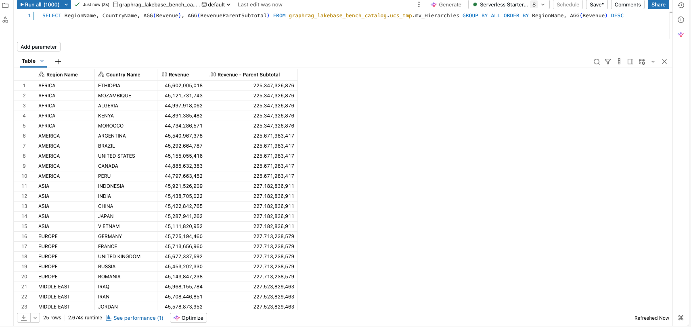
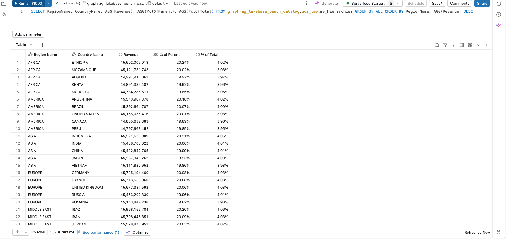

# :evergreen_tree: Hierarchies

## Introduction

Business data is organized into **hierarchies**: geographies (region → country → customer), product taxonomies (category → subcategory → product), org charts, and calendars (year → quarter → month). Reports browse them level by level, and the calculations people ask for change with the level: *what is the total for this branch?* (a rollup to the parent) and *what share of its parent does this row contribute?* (a percentage of the parent node).

This pattern shows how to express those in a [Unity Catalog semantics](https://docs.databricks.com/aws/en/business-semantics/) metric view for a **fixed-depth** hierarchy, one whose levels are known columns you already join to (region → country → customer). The measures are `window-function-over-aggregate` expressions, the same building block as the [Ranking](../Ranking/) patterns, so no extra tables are required.

> [!NOTE]
> **Parent-child (self-referential) hierarchies** — a single table where each row points at its own `parent_id` and the depth is not known up front (org charts, bills-of-materials) — are a separate pattern and are not covered here.

## Preparation

1. Ensure that you have created the test dataset using the [tpc-h.sql](/tpc-h.sql) script.

2. Create the basic metric view definition. The full definition is in [`Hierarchies.yml`](./Hierarchies.yml); the base `Revenue` measure and the region → country → customer join hierarchy every measure below builds on are shown here.
    <details>
    <summary>Basic metric view definition</summary>

    ```yaml
    version: 1.1
    comment: Unity Catalog semantics patterns

    source: orders

    joins:
      - name: customer
        source: customer
        'on': source.o_custkey = customer.c_custkey
        rely:
          at_most_one_match: true
        joins:
          - name: nation
            source: nation
            'on': customer.c_nationkey = nation.n_nationkey
            rely:
              at_most_one_match: true
            joins:
              - name: region
                source: region
                'on': nation.n_regionkey = region.r_regionkey
                rely:
                  at_most_one_match: true

    fields:
      - name: RegionName
        display_name: Region Name
        expr: customer.nation.region.r_name
      - name: CountryName
        display_name: Country Name
        expr: customer.nation.n_name
      - name: CustomerName
        display_name: Customer Name
        expr: customer.c_name

    measures:
      - name: Revenue
        display_name: Revenue
        expr: SUM(o_totalprice)
        format:
          type: number
          decimal_places:
            type: exact
            places: 0
          hide_group_separator: false
          abbreviation: none
    ```

    </details>


## Parent subtotals — roll a leaf measure up to the parent level

**Sample question** — *Show each country's revenue, but carry its region's total on the same row so I can see the branch subtotal while drilling down.*

**Why it matters** — A drill-down table usually loses the parent's total once you expand it. A rollup measure repeats the parent-level aggregate on every child row, so the subtotal travels with the detail: no separate query, no client-side maths.

> [!NOTE]
> `SUM(SUM(measure)) OVER (PARTITION BY <parent level>)` is the key. The inner `SUM` is the metric view's own per-row aggregate, and the outer windowed `SUM` re-aggregates it up to the partition (the parent). This respects whatever `WHERE` / `GROUP BY` the query applies.

### Measure definition

```yaml
- name: RevenueParentSubtotal
  display_name: Revenue - Parent Subtotal
  expr: SUM(SUM(o_totalprice)) OVER (PARTITION BY `RegionName`)
  format:
    type: number
    decimal_places:
      type: exact
      places: 0
    hide_group_separator: false
    abbreviation: none
```

### Test query

Query the metric view at **region → country** grain. Measures are wrapped in `AGG(...)`; dimensions are selected bare (the repo-wide convention):

```sql
SELECT
  RegionName,
  CountryName,
  AGG(Revenue),
  AGG(RevenueParentSubtotal)
FROM mv_Hierarchies
GROUP BY ALL
ORDER BY RegionName, AGG(Revenue) DESC
```

<details>
<summary>Test query output</summary>



</details>


## Detecting the hierarchy level

DAX detects the level being browsed with `ISINSCOPE` and routes a single `% Parent` measure to the right denominator. Unity Catalog metric views have no direct equivalent: a measure's window is fixed in its definition, so each rollup or share measure targets a **specific** parent level (here, the region). What varies at query time is the **grain** you group by — group by region → country and the parent of a country row is its region, which is exactly what the measures here are written for. To reference a different parent level you define a measure for it explicitly, which is why this pattern keeps one *% of Parent* (the immediate ancestor) and one *% of Total* (the root) rather than one measure per level.

## Percentage of parent node

**Sample question** — *What share of its region does each country contribute, and what share of the whole business?*

**Why it matters** — A percentage of the parent turns raw subtotals into "how much of the branch is this?", the ratio leaders actually compare. The denominator is the parent subtotal from the section above, so the children under one parent always sum to 100%.

### Measure definition

```yaml
- name: PctOfParent
  display_name: "% of Parent"
  expr: SUM(o_totalprice) / NULLIF(SUM(SUM(o_totalprice)) OVER (PARTITION BY `RegionName`), 0)
  format:
    type: percentage
    decimal_places:
      type: exact
      places: 2

- name: PctOfTotal
  display_name: "% of Total"
  expr: SUM(o_totalprice) / NULLIF(SUM(SUM(o_totalprice)) OVER (), 0)
  format:
    type: percentage
    decimal_places:
      type: exact
      places: 2
```

> [!TIP]
> `NULLIF(..., 0)` guards the divide-by-zero when a filter empties a parent partition.

### Test query

```sql
SELECT
  RegionName,
  CountryName,
  AGG(Revenue),
  AGG(PctOfParent),
  AGG(PctOfTotal)
FROM mv_Hierarchies
GROUP BY ALL
ORDER BY RegionName, AGG(Revenue) DESC
```

<details>
<summary>Test query output</summary>



</details>

Under each region the `% of Parent` values sum to 100%, and `% of Total` is each country's share of the grand total.

## End-to-end template

The end-to-end reference implementation can be found in the [Hierarchies](./Hierarchies.yml) YAML file.
