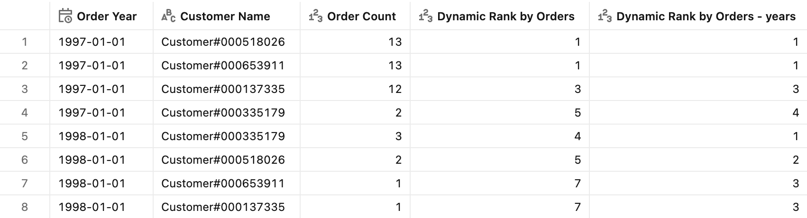
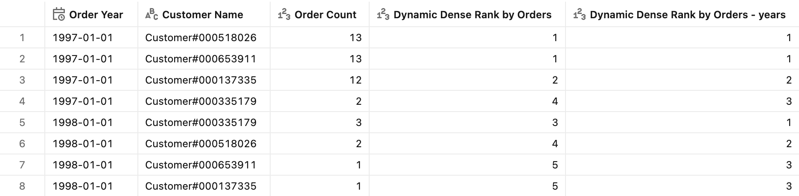
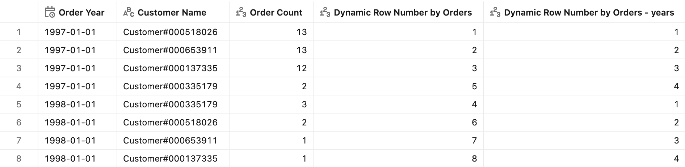
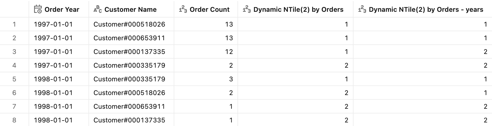
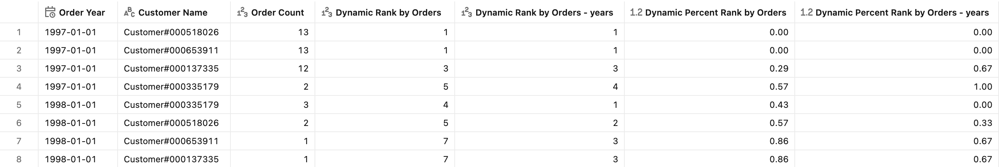
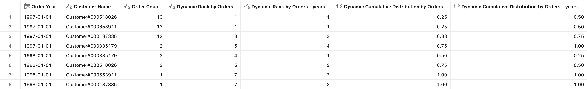
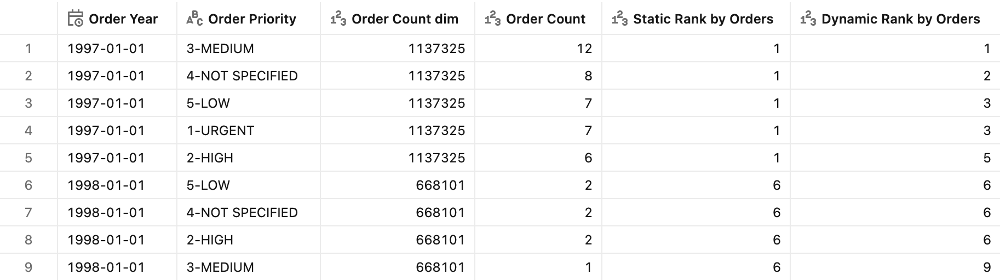

# :trophy: Ranking

## Introduction

Ranking answers the "who's on top?" questions that leaders ask constantly: *Who are our biggest customers? Who leads within each year?* A rank turns a raw measure, e.g., order count, into a position (1st, 2nd, 3rd, …) or a relative standing (top half, percentile), making it easy to spot leaders, laggards, and where any single entity sits in the pack.

This group of patterns defines measures leveraging [ranking window functions](https://docs.databricks.com/aws/en/sql/language-manual/sql-ref-functions-builtin#ranking-window-functions) computed over an aggregate.

**Dynamic ranking** patterns use window functions over an aggregate that **recompute for whatever `WHERE`/`GROUP BY` the query uses**, so ranks always respect the current filters. These patterns are provided in two versions:

- **Global** — ranks across the entire result set (no partitions).
- **Year** — ranks restart within each group via `PARTITION BY Year`.

The [Static Ranking](#static-ranking--a-fixed-rank-that-ignores-regrouping) pattern demonstrates the opposite trade-off: ranking over a precomputed value, thus the rank stays fixed regardless of how the query regroups.


## Preparation

1. Ensure that you have created the test dataset using the [tpc-h.sql](/tpc-h.sql) script.

2. Create the basic metric view definition, including the base `OrderCount` measure that every ranking measure orders by.
    <details>
    <summary>Basic metric view definition</summary>

    ```yaml
    version: 1.1
    comment: Unity Catalog semantics patterns

    source: orders

    joins:
      - name: customer
        source: customer
        'on': source.o_custkey = customer.c_custkey
        rely:
          at_most_one_match: true
        joins:
          - name: nation
            source: nation
            'on': customer.c_nationkey = nation.n_nationkey
            rely:
              at_most_one_match: true
            joins:
              - name: region
                source: region
                'on': nation.n_regionkey = region.r_regionkey
                rely:
                  at_most_one_match: true

    fields:
      - name: RegionName
        display_name: Region Name
        expr: customer.nation.region.r_name

      - name: CountryName
        display_name: Country Name
        expr: customer.nation.n_name

      - name: CustomerName
        display_name: Customer Name
        expr: customer.c_name

      - name: MarketSegment
        display_name: Market Segment
        expr: customer.c_mktsegment

      - name: OrderDate
        display_name: Order Date
        expr: o_orderdate
        format:
          type: date
          date_format: year_month_day
          leading_zeros: true

      - name: Year
        display_name: Order Year
        expr: DATE_TRUNC('year', o_orderdate)
        format:
          type: date
          date_format: year_month_day
          leading_zeros: true

      - name: Month
        display_name: Order Month
        expr: DATE_TRUNC('month', o_orderdate)
        format:
          type: date
          date_format: year_month_day
          leading_zeros: true

      - name: Quarter
        display_name: Order Quarter
        expr: DATE_TRUNC('quarter', o_orderdate)
        format:
          type: date
          date_format: year_month_day
          leading_zeros: true

      - name: OrderPriority
        display_name: Order Priority
        expr: o_orderpriority

      - name: ShipPriority
        display_name: Ship Priority
        expr: o_shippriority

    measures:
      - name: OrderCount
        display_name: Order Count
        comment: Count of orders
        expr: COUNT(o_orderkey)
        format:
          type: number
          decimal_places:
            type: all
          hide_group_separator: false
          abbreviation: none
    ```

    </details>


## Basic Ranking — leaderboard position, gaps after ties

**Sample question** - *Which customers place the most orders with us, and how does that leaderboard shift year over year?*

**Why it matters** - This is the everyday "who's on top?" leaderboard. The gaps after ties are honest: if two customers tie for 1st, the next is genuinely 3rd, so the rank number still reflects how many accounts sit above you.

> [!NOTE]
> `RANK` gives tied rows **the same rank**, then **skips** the next *n-1* ranks (so ranks have gaps after a tie).


### Measure definition

```yaml
- name: DynamicRankOrderCount
  display_name: Dynamic Rank by Orders
  expr: RANK() OVER (ORDER BY COUNT(o_orderkey) DESC)
  format:
    type: number
    decimal_places:
      type: all
    hide_group_separator: false
    abbreviation: none

- name: YearRankOrderCount
  display_name: Dynamic Rank by Orders - Year
  expr: RANK() OVER (PARTITION BY `Year` ORDER BY COUNT(o_orderkey) DESC)
  format:
    type: number
    decimal_places:
      type: all
    hide_group_separator: false
    abbreviation: none
```

> [!TIP]
> You can narrow grouping further with ``PARTITION BY `Year`, <ColumnName>``. The same applies to all patterns discussed further.

### Test query

```sql
SELECT
  `Year`,
  CustomerName,
  AGG(OrderCount),
  AGG(DynamicRankOrderCount),
  AGG(YearRankOrderCount)
FROM mv_Ranking
WHERE (`Year` = '1998-01-01' OR `Year` = '1997-01-01')
  AND CustomerName IN ('Customer#000137335','Customer#000653911','Customer#000518026','Customer#000335179')
GROUP BY ALL
ORDER BY `Year`, AGG(OrderCount) DESC
```

<details>
<summary>Test query output</summary>



</details>


## Dense Ranking — buying tiers, no gaps after ties

**Sample question** - *When several customers order at the same volume, which distinct tiers of buying activity do they fall into?*

**Why it matters** - Use it when you care about *distinct levels* rather than exact position — e.g. grouping accounts into buying tiers (tier 1, tier 2, tier 3) where the count of tiers should stay compact no matter how many customers land in each.

> [!NOTE]
> `DENSE_RANK` gives tied rows the same rank but does **not** skip the following ranks, so the sequence has no gaps.

### Measure definition

```yaml
- name: DynamicDenseRankOrderCount
  display_name: Dynamic Dense Rank by Orders
  expr: DENSE_RANK() OVER (ORDER BY COUNT(o_orderkey) DESC)
  format:
    type: number
    decimal_places:
      type: all
    hide_group_separator: false
    abbreviation: none

- name: YearDenseRankOrderCount
  display_name: Dynamic Dense Rank by Orders - Year
  expr: DENSE_RANK() OVER (PARTITION BY `Year` ORDER BY COUNT(o_orderkey) DESC)
  format:
    type: number
    decimal_places:
      type: all
    hide_group_separator: false
    abbreviation: none
```

### Test query

```sql
SELECT
  `Year`,
  CustomerName,
  AGG(OrderCount),
  AGG(DynamicDenseRankOrderCount),
  AGG(YearDenseRankOrderCount)
FROM mv_Ranking
WHERE (`Year` = '1998-01-01' OR `Year` = '1997-01-01')
  AND CustomerName IN ('Customer#000137335','Customer#000653911','Customer#000518026','Customer#000335179')
GROUP BY ALL
ORDER BY `Year`, AGG(OrderCount) DESC
```

<details>
<summary>Test query output</summary>



</details>


## Row Number — one name per position (#1, #2, #3)

**Sample question** - *Who exactly is our #1, #2, and #3 customer by order volume when we need a single name per position?*

**Why it matters** - Use it when the business needs *exactly one* entity in each position: picking a single winner per group, cutting a clean top-N list (exactly 10 rows, never 12), or keeping the "latest/first" record and dropping duplicates.

> [!NOTE]
> `ROW_NUMBER` assigns a **strict 1-per-row sequence** with no ties and no gaps. Ties are broken **arbitrarily**: if two customers have the same order count, which one becomes #1 is not meaningful — and may flip on every refresh. Add a tiebreaker to the `ORDER BY` (e.g. `COUNT(o_orderkey) DESC, CustomerName`) whenever the position needs to be stable.

### Measure definition

```yaml
- name: DynamicRowNumberOrderCount
  display_name: Dynamic Row Number by Orders
  expr: ROW_NUMBER() OVER (ORDER BY COUNT(o_orderkey) DESC)
  format:
    type: number
    decimal_places:
      type: all
    hide_group_separator: false
    abbreviation: none

- name: YearRowNumberOrderCount
  display_name: Dynamic Row Number by Orders - Year
  expr: ROW_NUMBER() OVER (PARTITION BY `Year` ORDER BY COUNT(o_orderkey) DESC)
  format:
    type: number
    decimal_places:
      type: all
    hide_group_separator: false
    abbreviation: none
```

### Test query

```sql
SELECT
  `Year`,
  CustomerName,
  AGG(OrderCount),
  AGG(DynamicRowNumberOrderCount),
  AGG(YearRowNumberOrderCount)
FROM mv_Ranking
WHERE (`Year` = '1998-01-01' OR `Year` = '1997-01-01')
  AND CustomerName IN ('Customer#000137335','Customer#000653911','Customer#000518026','Customer#000335179')
GROUP BY ALL
ORDER BY `Year`, AGG(OrderCount) DESC
```

<details>
<summary>Test query output</summary>



</details>


## Buckets — split accounts into top/bottom halves or quartiles

**Sample question** - *Which customers belong in our top half versus bottom half of accounts by order activity?*

**Why it matters** - It turns a continuous measure into equal-sized segments for action — e.g. targeting the top quartile with a loyalty offer or the bottom decile with a win-back campaign — without you having to pick threshold values by hand.

> [!NOTE]
> `NTILE(2)` divides the ordered rows into two roughly equal buckets (1 = top half by order count, 2 = bottom half). Use a larger *n* for quartiles (`NTILE(4)`), deciles, etc.

### Measure definition

```yaml
- name: DynamicNTile2OrderCount
  display_name: Dynamic NTile(2) by Orders
  expr: NTILE(2) OVER (ORDER BY COUNT(o_orderkey) DESC)
  format:
    type: number
    decimal_places:
      type: all
    hide_group_separator: false
    abbreviation: none

- name: YearNTile2OrderCount
  display_name: Dynamic NTile(2) by Orders - Year
  expr: NTILE(2) OVER (PARTITION BY `Year` ORDER BY COUNT(o_orderkey) DESC)
  format:
    type: number
    decimal_places:
      type: all
    hide_group_separator: false
    abbreviation: none
```

### Test query

```sql
SELECT
  `Year`,
  CustomerName,
  AGG(OrderCount),
  AGG(DynamicNTile2OrderCount),
  AGG(YearNTile2OrderCount)
FROM mv_Ranking
WHERE (`Year` = '1998-01-01' OR `Year` = '1997-01-01')
  AND CustomerName IN ('Customer#000137335','Customer#000653911','Customer#000518026','Customer#000335179')
GROUP BY ALL
ORDER BY `Year`, AGG(OrderCount) DESC, AGG(YearNTile2OrderCount) ASC
```

<details>
<summary>Test query output</summary>



</details>


## Percentile Standing — relative standing within the pack

**Sample question** - *Where does each customer stand relative to the rest of our base — are they a top-percentile account or mid-pack?*

**Why it matters** - Unlike a raw rank, a percentile is comparable across groups of different sizes: "top 5%" means the same thing whether the segment has 50 customers or 5,000, so it travels well into SLAs, tiering rules, and cross-region comparisons.

> [!NOTE]
> `PERCENT_RANK` returns relative standing in `[0, 1]` — `0` is the top customer, higher values are lower-ranked. It is shown here alongside `RANK` for context.

### Measure definition

```yaml
- name: DynamicPercentRankOrderCount
  display_name: Dynamic Percent Rank by Orders
  expr: PERCENT_RANK() OVER (ORDER BY COUNT(o_orderkey) DESC)
  format:
    type: number
    decimal_places:
      type: exact
      places: 2
    hide_group_separator: false
    abbreviation: none

- name: YearPercentRankOrderCount
  display_name: Dynamic Percent Rank by Orders - Year
  expr: PERCENT_RANK() OVER (PARTITION BY `Year` ORDER BY COUNT(o_orderkey) DESC)
  format:
    type: number
    decimal_places:
      type: exact
      places: 2
    hide_group_separator: false
    abbreviation: none
```

### Test query

```sql
SELECT
  `Year`,
  CustomerName,
  AGG(OrderCount),
  AGG(DynamicRankOrderCount),
  AGG(YearRankOrderCount),
  AGG(DynamicPercentRankOrderCount),
  AGG(YearPercentRankOrderCount)
FROM mv_Ranking
WHERE (`Year` = '1998-01-01' OR `Year` = '1997-01-01')
  AND CustomerName IN ('Customer#000137335','Customer#000653911','Customer#000518026','Customer#000335179')
GROUP BY ALL
ORDER BY `Year`, AGG(OrderCount) DESC
```

<details>
<summary>Test query output</summary>



</details>


## Cumulative Distribution — what share of customers rank at or below

**Sample question** - *What share of our customers order at or below each account's volume — which percentile tier does every customer fall into?*

**Why it matters** - It answers "what share of the base falls at or below this point?" directly — the natural framing for cumulative cut-offs like "the accounts making up the bottom 20%" or "everyone up to the median" — which a plain rank can't express.

When comparing customers on a leaderboard, the `ORDER BY` direction is critical — it defines what a small vs. large value means:

- **`DESC`** (used above) puts the highest-volume customer first, so a **small** value marks a **top account**. This answers *"how far into the leaderboard is this customer?"* — e.g. `0.05` means this customer is in the top 5% by order volume. Use `DESC` when a **high** measure is the "good" end (biggest customers, top-selling products, highest revenue).
- **`ASC`** reverses it: the lowest-volume customer comes first, so a **small** value now marks the **bottom** of the base. This answers *"what share of customers order this little or less?"* — e.g. `0.05` means this customer is in the bottom 5%. Use `ASC` when a **low** measure is what you want to surface (least-active accounts, slowest movers, smallest spenders to flag for churn or win-back).

In short: keep the leader at `CUME_DIST` near `0` by ordering `DESC` for "who's on top" questions, and order `ASC` when the question is "who's at the bottom." The same rule applies to `PERCENT_RANK`, `RANK`, and `ROW_NUMBER` — the ordering direction is how you point the ranking at the tail of the distribution you care about.

> [!NOTE]
> `CUME_DIST` returns the fraction of rows with a value **less than or equal to** the current row within the ordered window, so it ranges in `(0, 1]`. Unlike `PERCENT_RANK` (which starts at `0` for the top row), `CUME_DIST` never returns `0` and always reaches `1.0` at the last row.

### Measure definition

```yaml
- name: DynamicCumeDistOrderCount
  display_name: Dynamic Cumulative Distribution by Orders
  expr: CUME_DIST() OVER (ORDER BY COUNT(o_orderkey) DESC)
  format:
    type: number
    decimal_places:
      type: exact
      places: 2
    hide_group_separator: false
    abbreviation: none

- name: YearCumeDistOrderCount
  display_name: Dynamic Cumulative Distribution by Orders - Year
  expr: CUME_DIST() OVER (PARTITION BY `Year` ORDER BY COUNT(o_orderkey) DESC)
  format:
    type: number
    decimal_places:
      type: exact
      places: 2
    hide_group_separator: false
    abbreviation: none
```

### Test query

```sql
SELECT
  `Year`,
  CustomerName,
  AGG(OrderCount),
  AGG(DynamicRankOrderCount),
  AGG(YearRankOrderCount),
  AGG(DynamicCumeDistOrderCount),
  AGG(YearCumeDistOrderCount)
FROM mv_Ranking
WHERE (`Year` = '1998-01-01' OR `Year` = '1997-01-01')
  AND CustomerName IN ('Customer#000137335','Customer#000653911','Customer#000518026','Customer#000335179')
GROUP BY ALL
ORDER BY `Year`, AGG(OrderCount) DESC
```

<details>
<summary>Test query output</summary>



</details>


## Static Ranking — a fixed rank that ignores regrouping

**Sample question** - *Which year was more productive overall, regardless of how I slice the results?*

**Why it matters** - A dynamic rank can be misleading in a filtered dashboard because it silently re-ranks whatever rows meet the filter conditions. A static rank stays anchored to a fixed total, so "the #1 year" means the same thing on every tab and slicer — essential when the ranking feeds an official scorecard or KPI.

All the patterns above rank over `COUNT(o_orderkey)`, which is recalculated at query time — so the rank **recomputes for whatever `WHERE`/`GROUP BY` the query uses**. Sometimes you instead want the rank to reflect a **fixed, precomputed value** that does not change when the query uses different filters or groupings. To do that, precompute the aggregate as a **dimension** with a window function, then rank over that dimension.

Add the `OrderCount_dim` dimension under `fields:` — a `COUNT` windowed over `PARTITION BY Year`, so every row carries its year's full order total:

```yaml
- name: OrderCount_dim
  display_name: Order Count dim
  expr: COUNT(o_orderkey) OVER (PARTITION BY `Year`)
```

> [!TIP]
> This pattern works for **all** the ranking functions shown above — swap `RANK()` for `DENSE_RANK()`, `ROW_NUMBER()`, `NTILE(n)`, `PERCENT_RANK()`, or `CUME_DIST()` to get a static variant of each.

### Measure definition

Rank over the precomputed `OrderCount_dim` dimension instead of the query-time `COUNT(o_orderkey)`:

```yaml
- name: StaticRankOrderCount
  display_name: Static Rank by Orders
  expr: RANK() OVER (ORDER BY `OrderCount_dim` DESC)
  format:
    type: number
    decimal_places:
      type: all
    hide_group_separator: false
    abbreviation: none
```

### Test query

```sql
SELECT
  `Year`,
  OrderPriority,
  OrderCount_dim,
  AGG(OrderCount),
  AGG(StaticRankOrderCount),
  AGG(DynamicRankOrderCount)
FROM mv_Ranking
WHERE (`Year` = '1998-01-01' OR `Year` = '1997-01-01')
  AND CustomerName IN ('Customer#000137335','Customer#000653911','Customer#000518026','Customer#000335179')
GROUP BY ALL
ORDER BY `Year`, AGG(OrderCount) DESC
```

Because `OrderCount_dim` is fixed per year, `StaticRankOrderCount` assigns the same rank to every row of a year (1 to all 1997 rows, 6 to all 1998 rows), while `DynamicRankOrderCount` re-ranks each grouped row by its own order count.

<details>
<summary>Test query output</summary>



</details>


## End-to-end template

The end-to-end reference implementation can be found in the [Ranking](./Ranking.yml) YAML file.
