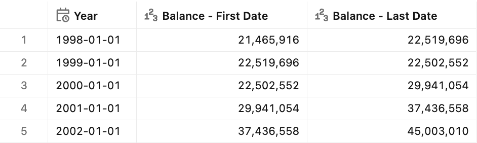
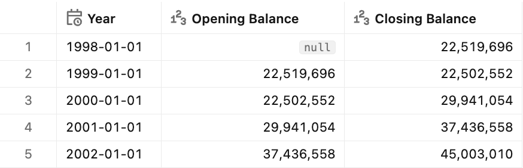
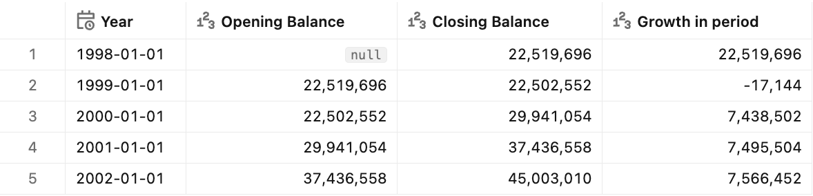

# :chart: Semi-additive calculations

## Introduction

Most numbers in business reports add up cleanly. If you sold 100 items in January, 100 in February, and 100 in March, your quarter total is 300. But some numbers don't work this way. Stock inventory is the classic example — if your warehouse held 100 items each month, you don't have 300 items at quarter's end. You still have 100. These are "semi-additive" values: they add up across products or locations, but not across time.


## Key implementation details

For demo purposes, we use the `inventory` table from the TPC-DS dataset, which contains stock inventory by product, warehouse, and date. Semi-additive calculations in Unity Catalog metric views can be implemented using [window measures](https://docs.databricks.com/aws/en/business-semantics/metric-views/advanced-techniques#window-measures) with optional offsets to define the right context of calculations:

```yaml
window:
  - order: Date             # Date ordering
    range: current
    semiadditive: first
```

> [!IMPORTANT]
> Due to the current limitations in Unity Catalog metric views, we create a derived table `inventory_daily` that contains inventory details for every day (no gaps) and pre-calculates the `inv_quantity_on_hand_prev_day` column, which equals `inv_quantity_on_hand` as of the previous day.


## Preparation

1. Ensure that you have created the test dataset using the [tpc-ds.sql](/tpc-ds.sql) script.

2. Create the basic metric view definition.
    <details>
    <summary>Basic metric view definition</summary>

    ```yaml
    version: 1.1
    comment: Unity Catalog semantics patterns

    source: inventory_daily

    joins:
      - name: date_dim
        source: date_dim
        'on': source.inv_date_sk = date_dim.d_date_sk
        rely:
          at_most_one_match: true
      - name: item
        source: item
        'on': source.inv_item_sk = item.i_item_sk
        rely:
          at_most_one_match: true
      - name: warehouse
        source: warehouse
        'on': source.inv_warehouse_sk = warehouse.w_warehouse_sk
        rely:
          at_most_one_match: true

    fields:
      - name: WarehouseName
        display_name: Warehouse Name
        expr: warehouse.w_warehouse_name

      - name: WarehouseID
        display_name: Warehouse ID
        expr: warehouse.w_warehouse_id

      - name: ProductName
        display_name: Product Name
        expr: item.i_product_name

      - name: Date
        display_name: Date
        expr: date_dim.d_date

      - name: Year
        display_name: Year
        expr: DATE_TRUNC('year', date_dim.d_date)
        format:
          type: date
          date_format: year_month_day
          leading_zeros: true

      - name: Quarter
        display_name: Quarter
        expr: DATE_TRUNC('quarter', date_dim.d_date)
        format:
          type: date
          date_format: year_month_day
          leading_zeros: true

      - name: Month
        display_name: Month
        expr: DATE_TRUNC('month', date_dim.d_date)
        format:
          type: date
          date_format: year_month_day
          leading_zeros: true

    measures:
      - name: _Quantity
        expr: SUM(inv_quantity_on_hand)

      - name: _QuantityPrevDay
        expr: SUM(inv_quantity_on_hand_prev_day)
    ```
    </details>


## First and last date

**Sample question** - *What is the balance as of the first / the last date?*

For the first and last date balance, we use simple window measures with a `semiadditive` definition.

### Measure definition

```yaml
- name: BalanceFirstDate
  display_name: Balance - First Date
  comment: The balance as of the first date in the current period
  expr: _Quantity
  window:
    - order: Date
      range: current
      semiadditive: first
  format:
    type: number
    decimal_places:
      type: exact
      places: 0
    hide_group_separator: false
    abbreviation: none

- name: BalanceLastDate
  display_name: Balance - Last Date
  comment: The balance as of the last date in the current period
  expr: _Quantity
  window:
    - order: Date
      range: current
      semiadditive: last
  format:
    type: number
    decimal_places:
      type: exact
      places: 0
    hide_group_separator: false
    abbreviation: none
```

### Test query

```sql
SELECT `Year`, AGG(BalanceFirstDate), AGG(BalanceLastDate)
FROM mv_SemiAdditiveCalculations
GROUP BY ALL
ORDER BY `Year`;
```

<details>
<summary>Test query output</summary>



</details>


## Opening and closing balance

**Sample question** - *What is the opening / closing balance in the period?*

The *closing balance* is calculated simply as the balance as of the last date in the current period. However, the *opening balance* is not the same as the balance as of the first date in the current period.
The *opening balance* is the balance as of the last date of the preceding period. Therefore, we use the `_QuantityPrevDay` measure to calculate the opening balance.

### Measure definition

```yaml
- name: OpeningBalance
  display_name: Opening Balance
  comment: The balance as of the beginning of the current period (the same as of the last date in the preceding period)
  expr: _QuantityPrevDay
  window:
    - order: Date
      range: current
      semiadditive: first
  format:
    type: number
    decimal_places:
      type: exact
      places: 0
    hide_group_separator: false
    abbreviation: none

- name: ClosingBalance
  display_name: Closing Balance
  comment: The balance as of the end of the current period (the same as of the last date in the current period)
  expr: _Quantity
  window:
    - order: Date
      range: current
      semiadditive: last
  format:
    type: number
    decimal_places:
      type: exact
      places: 0
    hide_group_separator: false
    abbreviation: none
```

### Test query

```sql
SELECT `Year`, AGG(OpeningBalance), AGG(ClosingBalance)
FROM mv_SemiAdditiveCalculations
GROUP BY ALL
ORDER BY `Year`;
```

<details>
<summary>Test query output</summary>



</details>


## Growth in period

**Sample question** - *How did the balance change in the current period?*

The *growth in period* is calculated as the difference between the opening and the closing balance for a selected period.

> [!NOTE]
> We use `COALESCE` in the measure expression to correctly handle cases when opening or closing balance is empty (NULL).

### Measure definition

```yaml
- name: GrowthInPeriod
  display_name: Growth in period
  comment: The balance growth in the current period - the delta between opening and closing balances
  expr: COALESCE(AGG(ClosingBalance),0)-COALESCE(AGG(OpeningBalance),0)
  format:
    type: number
    decimal_places:
      type: exact
      places: 0
    hide_group_separator: false
    abbreviation: none
```

### Test query

```sql
SELECT `Year`, AGG(OpeningBalance), AGG(ClosingBalance), AGG(GrowthInPeriod)
FROM mv_SemiAdditiveCalculations
GROUP BY ALL
ORDER BY `Year`;
```

<details>
<summary>Test query output</summary>



</details>


## End-to-end template

The end-to-end reference implementation can be found in the [Semi-additive calculations](./Semi-additive%20calculations.yml) YAML file.
