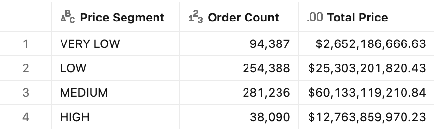
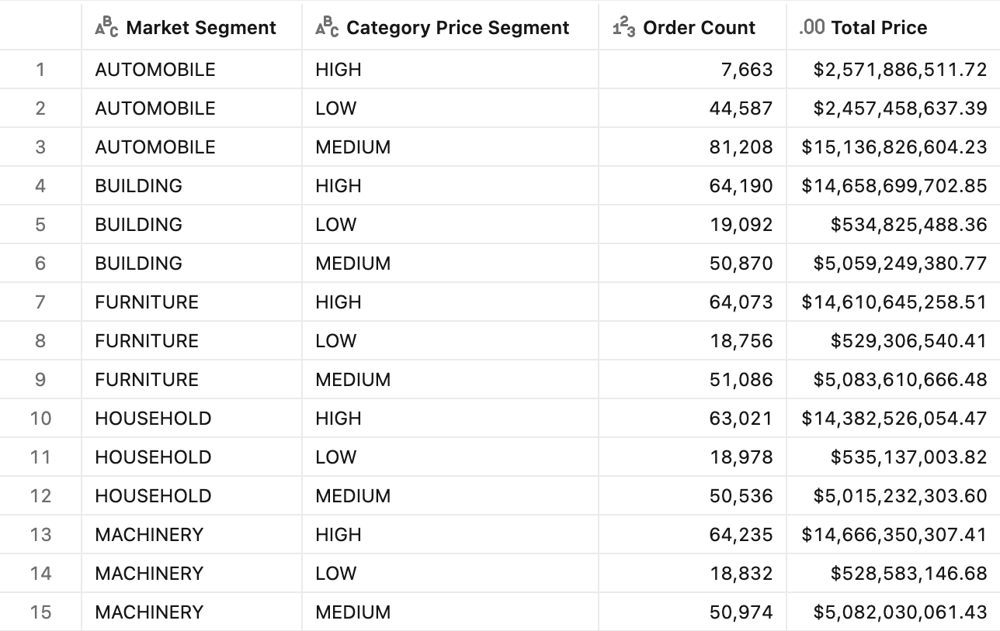
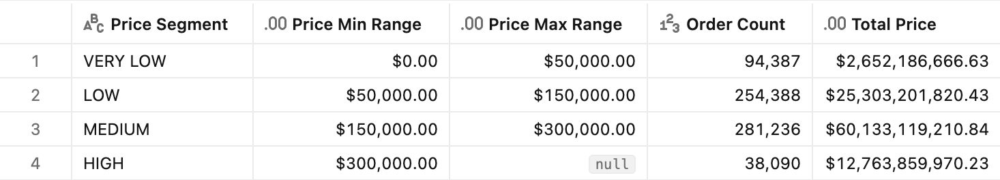

# :bar_chart: Static segmentation

## Introduction

The static segmentation pattern classifies numerical values into ranges. A typical example is the analysis of orders by price range: rather than reasoning about every individual order value — too many distinct values to be useful on their own — you group orders into a handful of **named ranges** (*very low, low, medium, high*) and compare the ranges instead. How many orders fall into each? How much revenue does each represent? How does the mix shift over time?

The segmentation here is *static* because the range boundaries are **fixed in the metric-view definition**. An order always falls into the same range regardless of how the query is filtered or grouped. The Unity Catalog metric view expresses the classification directly, as a `CASE` **dimension** evaluated on the base row grain. Any measure (`OrderCount`, `TotalPrice`) then aggregates naturally once you `GROUP BY` that dimension.

This article describes three variations of the pattern:

- **Static price-band segmentation** — one set of price boundaries applied to every order.
- **Per-category segmentation** — boundaries that differ by `MarketSegment`.
- **Segments from a configuration table** — boundaries owned by an external source and joined into the metric view.

> [!NOTE]
> Static segmentation uses **fixed** boundaries baked into the definition — the range never changes when the query regroups. The opposite trade-off is **dynamic** segmentation (for example `NTILE`/quantile buckets), where each entity's bucket is recomputed relative to whatever rows survive the current `WHERE`/`GROUP BY`. See the [Buckets](/Ranking/README.md#buckets--split-accounts-into-topbottom-halves-or-quartiles) section in the [Ranking](/Ranking/) folder for the dynamic approach.


## Preparation

1. Ensure that you have created the test dataset using the [tpc-h.sql](/tpc-h.sql) script.

2. Create the basic metric view definition, including the base `TotalPrice` and `OrderCount` measures that the segments aggregate.
    <details>
    <summary>Basic metric view definition</summary>

    ```yaml
    version: 1.1
    comment: Unity Catalog semantics patterns

    source: orders

    joins:
      - name: customer
        source: customer
        'on': source.o_custkey = customer.c_custkey
        rely:
          at_most_one_match: true
        joins:
          - name: nation
            source: nation
            'on': customer.c_nationkey = nation.n_nationkey
            rely:
              at_most_one_match: true
            joins:
              - name: region
                source: region
                'on': nation.n_regionkey = region.r_regionkey
                rely:
                  at_most_one_match: true

    fields:
      - name: RegionName
        display_name: Region Name
        expr: customer.nation.region.r_name

      - name: CountryName
        display_name: Country Name
        expr: customer.nation.n_name

      - name: CustomerName
        display_name: Customer Name
        expr: customer.c_name

      - name: MarketSegment
        display_name: Market Segment
        expr: customer.c_mktsegment

      - name: OrderDate
        display_name: Order Date
        expr: o_orderdate
        format:
          type: date
          date_format: year_month_day
          leading_zeros: true

      - name: Year
        display_name: Order Year
        expr: DATE_TRUNC('year', o_orderdate)
        format:
          type: date
          date_format: year_month_day
          leading_zeros: true

      - name: Month
        display_name: Order Month
        expr: DATE_TRUNC('month', o_orderdate)
        format:
          type: date
          date_format: year_month_day
          leading_zeros: true

      - name: Quarter
        display_name: Order Quarter
        expr: DATE_TRUNC('quarter', o_orderdate)
        format:
          type: date
          date_format: year_month_day
          leading_zeros: true

      - name: OrderPriority
        display_name: Order Priority
        expr: o_orderpriority

      - name: ShipPriority
        display_name: Ship Priority
        expr: o_shippriority

    measures:
      - name: TotalPrice
        display_name: Total Price
        comment: Sum of o_totalprice across all orders in the period
        expr: SUM(o_totalprice)
        format:
          type: currency
          currency_code: USD
          decimal_places:
            type: exact
            places: 2
          hide_group_separator: false
          abbreviation: none

      - name: OrderCount
        display_name: Order Count
        comment: Count of orders in the period
        expr: COUNT(o_orderkey)
        format:
          type: number
          decimal_places:
            type: all
          hide_group_separator: false
          abbreviation: none
    ```

    </details>


## Static price-band segmentation

**Sample question** - *How many orders and how much revenue fall into each order-value range — very low, low, medium, or high?*

You need to define a `PriceSegment` dimension with a `CASE` expression over `o_totalprice`. The boundaries follow the convention **`Min ≤ value < Max`** (lower-inclusive, upper-exclusive), so every order maps to exactly one range. A companion `PriceSegmentSort` dimension provides a numeric sort key, so the ranges display in business order (VERY LOW → HIGH) rather than alphabetically.

| Range     | Lower (inclusive) | Upper (exclusive) |
|-----------|-------------------|-------------------|
| VERY LOW  | 0                 | 50,000            |
| LOW       | 50,000            | 150,000           |
| MEDIUM    | 150,000           | 300,000           |
| HIGH      | 300,000           | —                 |

> [!NOTE]
> The thresholds above are illustrative for the tpc-h `orders` data (`o_totalprice` roughly spans ~900 to ~560,000). Adjust the boundaries to match your own value distribution.

### Measure definition

Add these two dimensions under `fields:`. They segment each row, and the base `OrderCount` and `TotalPrice` measures aggregate over them:

```yaml
- name: PriceSegment
  display_name: Price Segment
  expr: >
    CASE
      WHEN o_totalprice <  50000  THEN 'VERY LOW'
      WHEN o_totalprice < 150000  THEN 'LOW'
      WHEN o_totalprice < 300000  THEN 'MEDIUM'
      ELSE 'HIGH'
    END

- name: PriceSegmentSort
  display_name: Price Segment Sort
  expr: >
    CASE
      WHEN o_totalprice <  50000  THEN 1
      WHEN o_totalprice < 150000  THEN 2
      WHEN o_totalprice < 300000  THEN 3
      ELSE 4
    END
```

### Test query

```sql
SELECT
    PriceSegment,
    AGG(OrderCount),
    AGG(TotalPrice)
FROM mv_StaticSegmentation
WHERE Year = '1998-01-01'
GROUP BY ALL
ORDER BY MIN(PriceSegmentSort)
```

<details>
<summary>Test query output</summary>



</details>


## Per-category segmentation

**Sample question** - *Using price ranges tuned to each market segment, how do orders distribute — so that a "high-value" order means the right thing within its own segment?*

The pattern here is very similar to the previous one, except that the metric view nests the market segment into the `CASE`, so the same order value is classified against boundaries appropriate to its `MarketSegment`. Therefore `AUTOMOBILE` orders use higher thresholds than `FURNITURE` orders.

### Measure definition

```yaml
- name: CategoryPriceSegment
  display_name: Category Price Segment
  expr: >
    CASE customer.c_mktsegment
      WHEN 'AUTOMOBILE' THEN
        CASE
          WHEN o_totalprice < 100000 THEN 'LOW'
          WHEN o_totalprice < 300000 THEN 'MEDIUM'
          ELSE 'HIGH'
        END
      ELSE
        CASE
          WHEN o_totalprice <  50000 THEN 'LOW'
          WHEN o_totalprice < 150000 THEN 'MEDIUM'
          ELSE 'HIGH'
        END
    END
```

### Test query

```sql
SELECT
    MarketSegment,
    CategoryPriceSegment,
    AGG(OrderCount),
    AGG(TotalPrice)
FROM mv_StaticSegmentation
WHERE Year = '1998-01-01'
GROUP BY ALL
ORDER BY MarketSegment, CategoryPriceSegment
```

<details>
<summary>Test query output</summary>



</details>


## Segments from a configuration table

**Sample question** - *When our price ranges — or customer segments — are owned by another team or produced by a model, how do we plug them into the metric view without rewriting the definition every time they change?*

The `CASE`-based patterns above are the right starting point, but they assume that the business owns the boundaries and that those boundaries rarely move. In practice, segmentation is usually **not** a fixed rule typed into a report:

- It often comes out of a **machine-learning pipeline** — churn-risk tiers, propensity or lifetime-value ranges, RFM scores — that is retrained on a schedule and writes its results to a table.
- Or it is **governed elsewhere** — a finance-owned pricing-tier table, a CRM's customer-value grades, a reference dataset shared across the company — and simply lands in the lakehouse as another source.

In all of these cases the segment definition is **data, not code**: it lives in its own table, it is refreshed on its own cadence, and the analytics layer should consume it rather than re-encode it. Hard-coding the same thresholds inside every metric view means that each refresh of the model or the pricing policy becomes an engineering change — and different reports quietly drift apart.

Therefore, the pattern is to keep the range boundaries in a **configuration table** and **join** the metric view to it, so that the `CASE` reads the segment straight from the joined source instead of embedding the numbers. Editing the segments is then a data update — rerun the pipeline, or change a row — with no change to the metric-view definition, and every report stays consistent because they all read the same source of truth.

To keep this example self-contained, [`Static_segmentation_config.sql`](./Static_segmentation_config.sql) **mocks** the upstream table: a global `price_segment_range`, holding one row per range with a name, a sort order, and its lower/upper bounds. In a real deployment this table is exactly where the ML pipeline or the external system would publish its output, and you would point the join at that table instead.

### Measure definition

The metric view **range-joins** each order to the configuration table on the range's bounds (lower-inclusive, upper-exclusive, with an open-ended top range), and the segment dimension simply surfaces the matched range name, falling back to `UNCLASSIFIED` for any value the table doesn't cover:

```yaml
joins:
  - name: price_segment_range
    source: price_segment_range
    'on': >
      source.o_totalprice >= price_segment_range.min_price
      AND (source.o_totalprice < price_segment_range.max_price
           OR price_segment_range.max_price IS NULL)
    rely:
      at_most_one_match: true

fields:
  - name: PriceSegment
    display_name: Price Segment
    expr: >
      CASE
        WHEN price_segment_range.segment_name IS NULL THEN 'UNCLASSIFIED'
        ELSE price_segment_range.segment_name
      END

  - name: PriceSegmentSort
    display_name: Price Segment Sort
    expr: >
      CASE
        WHEN price_segment_range.segment_sort IS NULL THEN 99
        ELSE price_segment_range.segment_sort
      END

  - name: PriceMinRange
    display_name: Price Min Range
    expr: price_segment_range.min_price
    format:
      type: currency
      currency_code: USD
      decimal_places:
        type: exact
        places: 2
      hide_group_separator: false
      abbreviation: none

  - name: PriceMaxRange
    display_name: Price Max Range
    expr: price_segment_range.max_price
    format:
      type: currency
      currency_code: USD
      decimal_places:
        type: exact
        places: 2
      hide_group_separator: false
      abbreviation: none
```

### Test query

```sql
SELECT
    PriceSegment,
    PriceMinRange,
    PriceMaxRange,
    AGG(OrderCount),
    AGG(TotalPrice)
FROM mv_StaticSegmentation_config
WHERE Year = '1998-01-01'
GROUP BY ALL
ORDER BY MIN(PriceSegmentSort)
```

<details>
<summary>Test query output</summary>



</details>


## End-to-end template

Two end-to-end reference implementations are provided:

- [`Static_segmentation.yml`](./Static_segmentation.yml) — ranges defined **inline** with `CASE`, for when the business owns a small, stable set of boundaries.
- [`Static_segmentation_config.yml`](./Static_segmentation_config.yml) — ranges **sourced from a joined configuration table** ([`Static_segmentation_config.sql`](./Static_segmentation_config.sql)), for when segments come from an ML pipeline or an external system and change on their own cadence.
