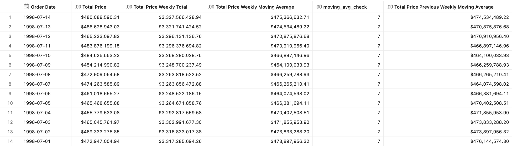
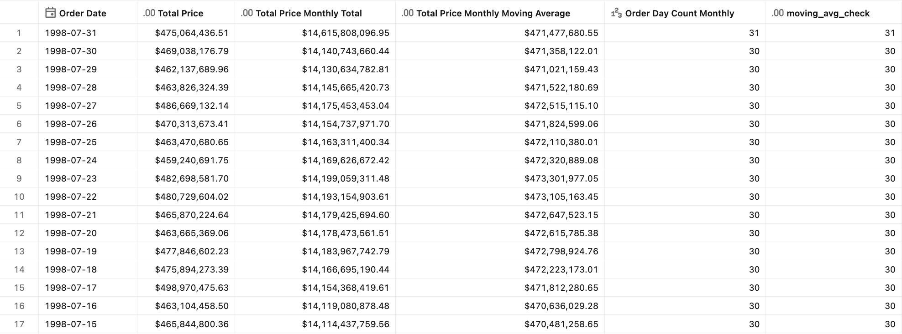
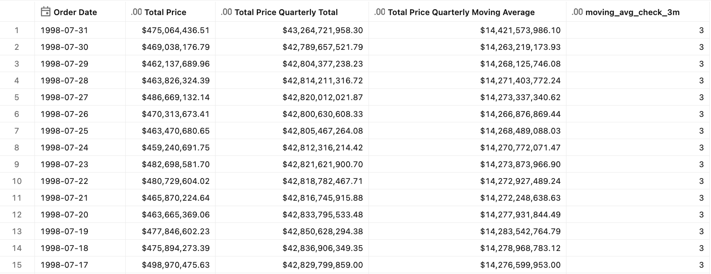
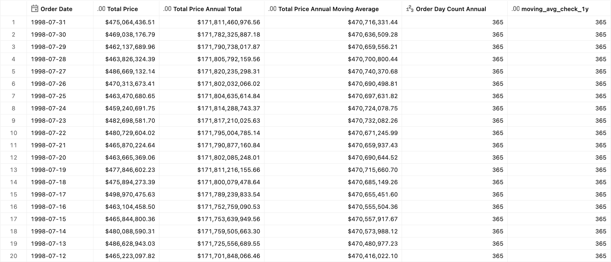
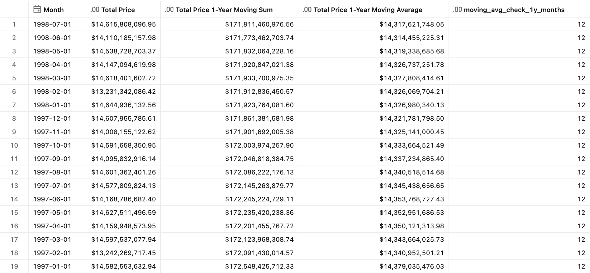

# Moving calculations

## Introduction

A "moving calculation" aggregates nearby values with a specific function over a rolling window, like a "moving average" does by averaging nearby values over a rolling window. It matters because it smooths out noisy data to estimate real progress against a meaningful window: the week, month, quarter, or year. In general, it answers the question: "What is the underlying trend if we smooth out short-term ups and downs?"

> [!NOTE]
> For rolling calculations, you can choose whether to include or exclude the current date (anchor row) in the calculation window. Excluding the current date is useful when data is loaded in daily batches and the most recent fully available date is yesterday, so the latest result always reflects a complete period.


## Preparation

1. Ensure that you have created the test dataset using the [tpc-h.sql](/tpc-h.sql) script.

2. Create the basic metric view definition.
    <details>
    <summary>Basic metric view definition</summary>

    ```yaml
    version: 1.1
    comment: Unity Catalog semantics patterns

    source: orders

    joins:
      - name: customer
        source: customer
        'on': source.o_custkey = customer.c_custkey
        rely:
          at_most_one_match: true
        joins:
          - name: nation
            source: nation
            'on': customer.c_nationkey = nation.n_nationkey
            rely:
              at_most_one_match: true
            joins:
              - name: region
                source: region
                'on': nation.n_regionkey = region.r_regionkey
                rely:
                  at_most_one_match: true

    fields:
      - name: RegionName
        display_name: Region Name
        expr: customer.nation.region.r_name

      - name: CountryName
        display_name: Country Name
        expr: customer.nation.n_name

      - name: CustomerName
        display_name: Customer Name
        expr: customer.c_name

      - name: MarketSegment
        display_name: Market Segment
        expr: customer.c_mktsegment

      - name: OrderDate
        display_name: Order Date
        expr: o_orderdate
        format: 
          type: date
          date_format: year_month_day
          leading_zeros: true

      - name: Year
        display_name: Order Year
        expr: DATE_TRUNC('year', o_orderdate)
        format: 
          type: date
          date_format: year_month_day
          leading_zeros: true

      - name: Month
        display_name: Order Month
        expr: DATE_TRUNC('month', o_orderdate)
        format: 
          type: date
          date_format: year_month_day
          leading_zeros: true

      - name: Quarter
        display_name: Order Quarter
        expr: DATE_TRUNC('quarter', o_orderdate)
        format: 
          type: date
          date_format: year_month_day
          leading_zeros: true

      - name: OrderPriority
        display_name: Order Priority
        expr: o_orderpriority

      - name: ShipPriority
        display_name: Ship Priority
        expr: o_shippriority

    measures:
      - name: TotalPrice
        display_name: Total Price
        comment: Sum of o_totalprice across all orders in the period
        expr: SUM(o_totalprice)
        format:
          type: currency
          currency_code: USD
          decimal_places:
            type: exact
            places: 2
          hide_group_separator: false
          abbreviation: none
    ```

    </details>


## 7-day moving window

**Sample question** - *What is the 7-day rolling total and daily average of total price?*

> [!NOTE]
> The pattern includes two measures with inclusive and exclusive behavior for the current row.

### Measure definition

```yaml
- name: TotalPrice7DayMovingSum
  display_name: Total Price Weekly Total
  comment: Rolling sum of TotalPrice over the trailing 7 days, inclusive of the current day
  expr: AGG(TotalPrice)
  window:
    - order: OrderDate
      semiadditive: last
      range: trailing 7 day inclusive
  format:
    type: currency
    currency_code: USD
    decimal_places:
      type: exact
      places: 2
    hide_group_separator: false
    abbreviation: none

- name: TotalPrice7DayMovingAvg
  display_name: Total Price Weekly Moving Average
  comment: Average daily TotalPrice over the trailing 7 days, inclusive of the current day (rolling sum ÷ 7)
  expr: AGG(TotalPrice)/7
  window:
    - order: OrderDate
      semiadditive: last
      range: trailing 7 day inclusive
  format:
    type: currency
    currency_code: USD
    decimal_places:
      type: exact
      places: 2
    hide_group_separator: false
    abbreviation: none

- name: TotalPrice7DayPrevMovingAvg
  display_name: Total Price Previous Weekly Moving Average
  comment: Average daily TotalPrice over the trailing 7 days, excluding the current day (rolling sum ÷ 7)
  expr: AGG(TotalPrice)/7
  window:
    - order: OrderDate
      semiadditive: last
      range: trailing 7 day exclusive
  format:
    type: currency
    currency_code: USD
    decimal_places:
      type: exact
      places: 2
    hide_group_separator: false
    abbreviation: none
```

### Test query

```sql
SELECT
    OrderDate
    , AGG(TotalPrice)
    , AGG(TotalPrice7DayMovingSum)
    , AGG(TotalPrice7DayMovingAvg)
    , ROUND(AGG(TotalPrice7DayMovingSum) / AGG(TotalPrice7DayMovingAvg), 0)  AS moving_avg_check  -- should equal 7
    , AGG(TotalPrice7DayPrevMovingAvg)
FROM mv_MovingCalculations
WHERE OrderDate >= '1998-07-01' AND OrderDate <= '1998-07-14'
GROUP BY ALL
ORDER BY OrderDate DESC;
```

<details>
<summary>Test query output</summary>



</details>


## 1-month moving window

**Sample question** - *What is the 1-month rolling total and daily average of total price over the trailing month?*

> [!NOTE]
> This monthly calculation is based on the actual day count. Some organizations might intentionally use 28-day windows instead of calendar-month windows to reduce day-of-week and month-length effects. For that approach, use the previous pattern with a 28-day window.

### Measure definition

```yaml
- name: TotalPrice1MonthMovingSum
  display_name: Total Price Monthly Total
  comment: Rolling sum of TotalPrice over the trailing 1-month window, inclusive of the current day
  expr: AGG(TotalPrice)
  window:
    - order: OrderDate
      semiadditive: last
      range: trailing 1 month inclusive
  format:
    type: currency
    currency_code: USD
    decimal_places:
      type: exact
      places: 2
    hide_group_separator: false
    abbreviation: none

- name: OrderDayCount1Month
  display_name: Order Day Count Monthly
  comment: Number of distinct dates with orders in the trailing 1-month window
  expr: COUNT(DISTINCT o_orderdate)
  window:
    - order: OrderDate
      semiadditive: last
      range: trailing 1 month inclusive

- name: TotalPrice1MonthMovingAvg
  display_name: Total Price Monthly Moving Average
  comment: Average daily TotalPrice over the trailing 1-month window, divided by the actual number of distinct dates with orders in the period
  expr: AGG(TotalPrice1MonthMovingSum) / AGG(OrderDayCount1Month)
  format:
    type: currency
    currency_code: USD
    decimal_places:
      type: exact
      places: 2
    hide_group_separator: false
    abbreviation: none
```

### Test query

```sql
SELECT
    OrderDate
    , AGG(TotalPrice)
    , AGG(TotalPrice1MonthMovingSum)
    , AGG(TotalPrice1MonthMovingAvg)
    , AGG(OrderDayCount1Month) 
    , ROUND(AGG(TotalPrice1MonthMovingSum) / AGG(TotalPrice1MonthMovingAvg), 0)    AS moving_avg_check  -- should equal real_day_count
FROM mv_MovingCalculations
WHERE OrderDate >= '1998-06-01' AND OrderDate <= '1998-07-31'
GROUP BY ALL
ORDER BY OrderDate DESC;
```

<details>
<summary>Test query output</summary>



</details>


## 1-quarter moving window

**Sample question** - *What is the 1-quarter rolling total and monthly average of total price over the trailing quarter?*

### Measure definition

```yaml
- name: TotalPrice1QuarterMovingSum
  display_name: Total Price Quarterly Total
  comment: Rolling sum of TotalPrice over the trailing 3-month (1-quarter) window, inclusive of the current day
  expr: AGG(TotalPrice)
  window:
    - order: OrderDate
      semiadditive: last
      range: trailing 3 month inclusive
  format:
    type: currency
    currency_code: USD
    decimal_places:
      type: exact
      places: 2
    hide_group_separator: false
    abbreviation: none

- name: TotalPrice1QuarterMovingAvg
  display_name: Total Price Quarterly Moving Average
  comment: Average monthly TotalPrice over a trailing 3-month (1-quarter) window, using a fixed divisor of 3 months
  expr: AGG(TotalPrice)/3
  window:
    - order: OrderDate
      semiadditive: last
      range: trailing 3 month inclusive
  format:
    type: currency
    currency_code: USD
    decimal_places:
      type: exact
      places: 2
    hide_group_separator: false
    abbreviation: none
```

### Test query

```sql
SELECT
    OrderDate
    , AGG(TotalPrice)
    , AGG(TotalPrice1QuarterMovingSum)
    , AGG(TotalPrice1QuarterMovingAvg)
    , ROUND(AGG(TotalPrice1QuarterMovingSum) / AGG(TotalPrice1QuarterMovingAvg), 0) AS moving_avg_check_3m  -- should equal 3
FROM mv_MovingCalculations
WHERE OrderDate >= '1998-01-01' AND OrderDate <= '1998-07-31'
GROUP BY ALL
ORDER BY OrderDate DESC;
```

<details>
<summary>Test query output</summary>



</details>


## 1-year moving window

**Sample question** - *What is the 1-year rolling total and daily average of total price over the trailing year?*

> [!IMPORTANT]
> **Performance note** — This pattern is based on an actual day count for more precise calculation. However, the 1-year window uses `order: OrderDate` (day grain), which produces a large range-join fanout (~365 rows per anchor date). If you only query at month/quarter/year level, switching to `order: Month, trailing 12 month` reduces the join fanout by ~30x. The same applies to the quarter calculations.

### Measure definition

```yaml
- name: TotalPrice1YearMovingSum
  display_name: Total Price Annual Total
  comment: Rolling sum of TotalPrice over the trailing 1-year window, inclusive of the current day
  expr: AGG(TotalPrice)
  window:
    - order: OrderDate
      semiadditive: last
      range: trailing 1 year inclusive
  format:
    type: currency
    currency_code: USD
    decimal_places:
      type: exact
      places: 2
    hide_group_separator: false
    abbreviation: none

- name: OrderDayCount1Year
  display_name: Order Day Count Annual
  comment: Number of distinct dates with orders in the trailing 1-year window
  expr: COUNT(DISTINCT o_orderdate)
  window:
    - order: OrderDate
      semiadditive: last
      range: trailing 1 year inclusive

- name: TotalPrice1YearMovingAvg
  display_name: Total Price Annual Moving Average
  comment: Average daily TotalPrice over the trailing 1-year window, divided by the actual number of distinct dates with orders in the period
  expr: AGG(TotalPrice1YearMovingSum) / AGG(OrderDayCount1Year)
  format:
    type: currency
    currency_code: USD
    decimal_places:
      type: exact
      places: 2
    hide_group_separator: false
    abbreviation: none
```

### Test query

```sql
SELECT
    OrderDate
    , AGG(TotalPrice)
    , AGG(TotalPrice1YearMovingSum)
    , AGG(TotalPrice1YearMovingAvg)
    , AGG(OrderDayCount1Year)
    , ROUND(AGG(TotalPrice1YearMovingSum) / AGG(TotalPrice1YearMovingAvg), 0) AS moving_avg_check_1y  -- should equal real_day_count_year
FROM mv_MovingCalculations
WHERE OrderDate >= '1996-08-01' AND OrderDate <= '1998-07-31'
GROUP BY ALL
ORDER BY OrderDate DESC;
```

<details>
<summary>Test query output</summary>



</details>


### Measure definition for the month-based calculation

```yaml
- name: TotalPrice1YearMovingSumByMonths
  display_name: Total Price 1-Year Moving Sum
  comment: Rolling sum of TotalPrice over the trailing 12-month window, inclusive of the current month
  expr: AGG(TotalPrice)
  window:
    - order: Month
      semiadditive: last
      range: trailing 12 month inclusive
  format:
    type: currency
    currency_code: USD
    decimal_places:
      type: exact
      places: 2
    hide_group_separator: false
    abbreviation: none

- name: TotalPrice1YearMovingAvgByMonths
  display_name: Total Price 1-Year Moving Average
  comment: Average monthly TotalPrice over the trailing 12-month window, divided by 12
  expr: AGG(TotalPrice1YearMovingSumByMonths) / 12
  format:
    type: currency
    currency_code: USD
    decimal_places:
      type: exact
      places: 2
    hide_group_separator: false
    abbreviation: none
```

### Test query for the month-based calculation

```sql
SELECT
    DATE(`Month`)
    , AGG(TotalPrice)
    , AGG(TotalPrice1YearMovingSumByMonths)
    , AGG(TotalPrice1YearMovingAvgByMonths)
    , ROUND(AGG(TotalPrice1YearMovingSumByMonths) / AGG(TotalPrice1YearMovingAvgByMonths), 0) AS moving_avg_check_1y_months
FROM mv_MovingCalculations
WHERE DATE(`Month`) >= '1996-08-01' AND DATE(`Month`) <= '1998-07-31'
GROUP BY ALL
ORDER BY `Month` DESC
```

<details>
<summary>Test query output</summary>



</details>


## End-to-end template

The end-to-end reference implementation can be found in the [Moving calculations](./Moving_calculations.yml) YAML file.
