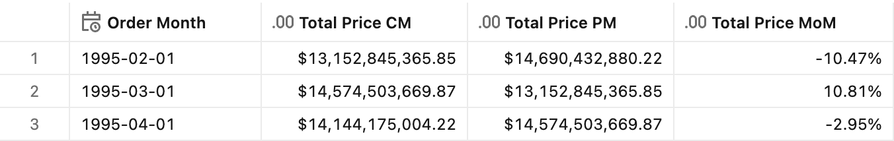
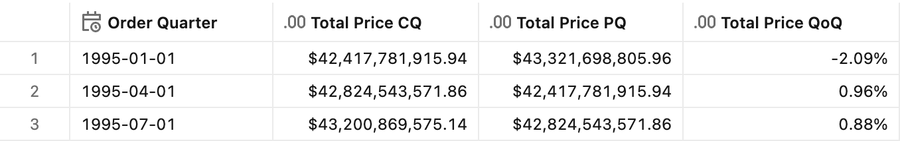
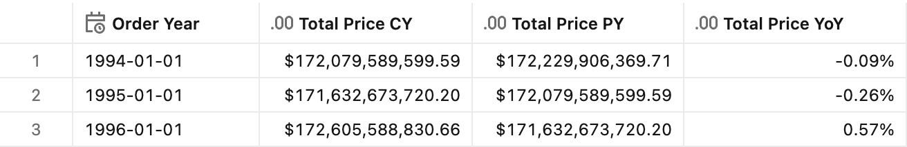
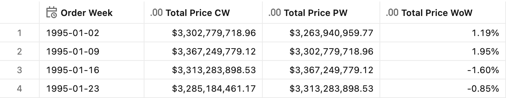

# Period-over-period growth

## Introduction

"Period-over-period growth" measures how a metric changes relative to the same type of period in the past — such as comparing this month's sales to last month's (month-over-month, MoM), this quarter's to last quarter's (quarter-over-quarter, QoQ), or this year's to last year's (year-over-year, YoY). These growth rates reveal momentum: whether the business is accelerating, decelerating, or holding steady. Leaders use them to understand trends, benchmark performance, and communicate progress in terms that adjust for the natural rhythm of the business calendar.

In Unity Catalog metric views, period-over-period growth is implemented using the `offset` feature in window definitions. The `offset` shifts the calculation backward by a specified time interval (e.g., `-1 month`, `-1 quarter`, `-1 year`, or `-7 days` for week-over-week). The growth rate is then calculated as a derived measure comparing the current value to the offset value.

## Why explicit current period measures?

Period-over-period growth calculations require **explicit current period measures** (e.g., `TotalPrice_CM` for current month) rather than using a raw base measure (`TotalPrice`). This is critical for correct results when the period dimension is NOT included in the GROUP BY clause.

### The problem with raw base measures

When you use a raw base measure without a window specification:
- `TotalPrice` aggregates **ALL** data within the query's filter range
- `TotalPrice_PM` (with window offset) returns only the **previous month's** value

This mismatch produces misleading growth rates:

| Query Type | TotalPrice | TotalPrice_PM | Calculated MoM |
|------------|------------|---------------|----------------|
| Month in GROUP BY | Feb value | Jan value | Correct |
| Year in GROUP BY (Month NOT included) | **Full year sum** | Dec only | +1000%+ (wrong) |

### The solution: explicit current period measures

By defining `TotalPrice_CM` with the same `semiadditive: last` semantic (but no offset), both measures use identical aggregation logic:

```yaml
- name: TotalPrice_CM
  expr: SUM(o_totalprice)
  window:
    - order: Month
      range: current
      semiadditive: last  # Returns LAST month's value in range

- name: TotalPrice_PM
  expr: SUM(o_totalprice)
  window:
    - order: Month
      range: current
      semiadditive: last
      offset: -1 month    # Returns month BEFORE the last
```

When Month is NOT in GROUP BY, `semiadditive: last` picks the **most recent** month's value, ensuring an apples-to-apples comparison.

### Behavior at finer granularity

When querying at a granularity **finer** than the period dimension (e.g., daily grain for monthly measures), the period-over-period measures return **NULL**. This is expected behavior:

- At daily grain, there is no meaningful "previous month's value for this specific day"
- The NULL result prevents misleading calculations
- To get MoM values at daily grain, include Month in your GROUP BY clause


## Preparation

1. Ensure that you have created the test dataset using the [tpc-h.sql](/tpc-h.sql) script.

2. Create the basic metric view definition.
    <details>
    <summary>Basic metric view definition</summary>

    ```yaml
    version: 1.1
    comment: Unity Catalog semantics patterns

    source: orders

    joins:
      - name: customer
        source: customer
        'on': source.o_custkey = customer.c_custkey
        rely:
          at_most_one_match: true
        joins:
            - name: nation
              source: nation
              'on': customer.c_nationkey = nation.n_nationkey
              rely:
                at_most_one_match: true
              joins:
                - name: region
                  source: region
                  'on': nation.n_regionkey = region.r_regionkey
                  rely:
                    at_most_one_match: true

    fields:
      - name: RegionName
        display_name: Region Name
        expr: customer.nation.region.r_name

      - name: CountryName
        display_name: Country Name
        expr: customer.nation.n_name

      - name: CustomerName
        display_name: Customer Name
        expr: customer.c_name

      - name: MarketSegment
        display_name: Market Segment
        expr: customer.c_mktsegment

      - name: OrderDate
        display_name: Order Date
        expr: o_orderdate
        format: 
          type: date
          date_format: year_month_day
          leading_zeros: true

      - name: Year
        display_name: Order Year
        expr: DATE_TRUNC('year', o_orderdate)
        format: 
          type: date
          date_format: year_month_day
          leading_zeros: true

      - name: Month
        display_name: Order Month
        expr: DATE_TRUNC('month', o_orderdate)
        format: 
          type: date
          date_format: year_month_day
          leading_zeros: true

      - name: Quarter
        display_name: Order Quarter
        expr: DATE_TRUNC('quarter', o_orderdate)
        format: 
          type: date
          date_format: year_month_day
          leading_zeros: true

      - name: Week
        display_name: Order Week
        expr: DATE_TRUNC('week', o_orderdate)
        format: 
          type: date
          date_format: year_month_day
          leading_zeros: true

      - name: OrderPriority
        display_name: Order Priority
        expr: o_orderpriority

      - name: ShipPriority
        display_name: Ship Priority
        expr: o_shippriority

    measures:
      - name: TotalPrice
        display_name: Total Price
        expr: SUM(o_totalprice)
        format:
          type: currency
          currency_code: USD
          decimal_places:
            type: exact
            places: 2
          hide_group_separator: false
          abbreviation: none
    ```

    </details>


## Month-over-month growth (MoM)

**Sample question** - *How much did sales grow compared to last month?*

### Measure definition

```yaml
- name: TotalPrice_CM
  display_name: Total Price CM
  comment: Total order price for the current month
  expr: SUM(o_totalprice)
  window:
    - order: Month
      range: current
      semiadditive: last
  format:
    type: currency
    currency_code: USD
    decimal_places:
      type: exact
      places: 2
    hide_group_separator: false
    abbreviation: none

- name: TotalPrice_PM
  display_name: Total Price PM
  comment: Total order price for the previous month
  expr: SUM(o_totalprice)
  window:
    - order: Month
      range: current
      semiadditive: last
      offset: -1 month
  format:
    type: currency
    currency_code: USD
    decimal_places:
      type: exact
      places: 2
    hide_group_separator: false
    abbreviation: none

- name: TotalPrice_MoM
  display_name: Total Price MoM
  comment: Month-over-month growth rate
  expr: (AGG(TotalPrice_CM) - AGG(TotalPrice_PM)) / AGG(TotalPrice_PM)
  format:
    type: percentage
    decimal_places:
      type: exact
      places: 2
```

### Test query

```sql
SELECT
    Month,
    AGG(TotalPrice_CM),
    AGG(TotalPrice_PM),
    AGG(TotalPrice_MoM)
FROM mv_PeriodOverPeriodGrowth
WHERE Month BETWEEN '1995-02-01' AND '1995-04-01'
GROUP BY ALL
ORDER BY Month
```

<details>
<summary>Test query output</summary>



</details>


## Quarter-over-quarter growth (QoQ)

**Sample question** - *How much did sales grow compared to last quarter?*

### Measure definition

```yaml
- name: TotalPrice_CQ
  display_name: Total Price CQ
  comment: Total order price for the current quarter
  expr: SUM(o_totalprice)
  window:
    - order: Quarter
      range: current
      semiadditive: last
  format:
    type: currency
    currency_code: USD
    decimal_places:
      type: exact
      places: 2
    hide_group_separator: false
    abbreviation: none

- name: TotalPrice_PQ
  display_name: Total Price PQ
  comment: Total order price for the previous quarter
  expr: SUM(o_totalprice)
  window:
    - order: Quarter
      range: current
      semiadditive: last
      offset: -3 months
  format:
    type: currency
    currency_code: USD
    decimal_places:
      type: exact
      places: 2
    hide_group_separator: false
    abbreviation: none

- name: TotalPrice_QoQ
  display_name: Total Price QoQ
  comment: Quarter-over-quarter growth rate
  expr: (AGG(TotalPrice_CQ) - AGG(TotalPrice_PQ)) / AGG(TotalPrice_PQ)
  format:
    type: percentage
    decimal_places:
      type: exact
      places: 2
```

### Test query

```sql
SELECT
    Quarter,
    AGG(TotalPrice_CQ),
    AGG(TotalPrice_PQ),
    AGG(TotalPrice_QoQ)
FROM mv_PeriodOverPeriodGrowth
WHERE Quarter BETWEEN '1995-01-01' AND '1995-07-01'
GROUP BY ALL
ORDER BY Quarter
```

<details>
<summary>Test query output</summary>



</details>


## Year-over-year growth (YoY)

**Sample question** - *How much did sales grow compared to the same period last year?*

### Measure definition

```yaml
- name: TotalPrice_CY
  display_name: Total Price CY
  comment: Total order price for the current year
  expr: SUM(o_totalprice)
  window:
    - order: Year
      range: current
      semiadditive: last
  format:
    type: currency
    currency_code: USD
    decimal_places:
      type: exact
      places: 2
    hide_group_separator: false
    abbreviation: none

- name: TotalPrice_PY
  display_name: Total Price PY
  comment: Total order price for the previous year
  expr: SUM(o_totalprice)
  window:
    - order: Year
      range: current
      semiadditive: last
      offset: -1 year
  format:
    type: currency
    currency_code: USD
    decimal_places:
      type: exact
      places: 2
    hide_group_separator: false
    abbreviation: none

- name: TotalPrice_YoY
  display_name: Total Price YoY
  comment: Year-over-year growth rate
  expr: (AGG(TotalPrice_CY) - AGG(TotalPrice_PY)) / AGG(TotalPrice_PY)
  format:
    type: percentage
    decimal_places:
      type: exact
      places: 2
```

### Test query

```sql
SELECT
    Year,
    AGG(TotalPrice_CY),
    AGG(TotalPrice_PY),
    AGG(TotalPrice_YoY)
FROM mv_PeriodOverPeriodGrowth
WHERE Year BETWEEN '1994-01-01' AND '1996-01-01'
GROUP BY ALL
ORDER BY Year
```

<details>
<summary>Test query output</summary>



</details>


## Week-over-week growth (WoW) - special case

For week-over-week comparisons, use fixed calendar week intervals (Monday-Sunday) with the `Week` dimension and `offset: -7 days`. This compares complete weeks rather than rolling 7-day windows, providing cleaner period boundaries for business reporting.

**Sample question** - *How much did sales grow compared to last week?*

> **Note:** This implementation uses Monday-Sunday weeks (Databricks default for `DATE_TRUNC('week', ...)`).
> For Sunday-Saturday weeks, replace the Week dimension with:
> ```yaml
> - name: Week
>   expr: DATE_TRUNC('week', o_orderdate + INTERVAL 1 DAY) - INTERVAL 1 DAY
> ```
> This shifts the week boundary to start on Sunday.

### Measure definition

```yaml
- name: TotalPrice_CW
  display_name: Total Price CW
  comment: Total order price for the current week (Mon-Sun)
  expr: SUM(o_totalprice)
  window:
    - order: Week
      range: current
      semiadditive: last
  format:
    type: currency
    currency_code: USD
    decimal_places:
      type: exact
      places: 2
    hide_group_separator: false
    abbreviation: none

- name: TotalPrice_PW
  display_name: Total Price PW
  comment: Total order price for the previous week (Mon-Sun)
  expr: SUM(o_totalprice)
  window:
    - order: Week
      range: current
      semiadditive: last
      offset: -7 days
  format:
    type: currency
    currency_code: USD
    decimal_places:
      type: exact
      places: 2
    hide_group_separator: false
    abbreviation: none

- name: TotalPrice_WoW
  display_name: Total Price WoW
  comment: Week-over-week growth rate (fixed Mon-Sun intervals)
  expr: (AGG(TotalPrice_CW) - AGG(TotalPrice_PW)) / AGG(TotalPrice_PW)
  format:
    type: percentage
    decimal_places:
      type: exact
      places: 2
```

### Test query

```sql
SELECT
    Week,
    AGG(TotalPrice_CW),
    AGG(TotalPrice_PW),
    AGG(TotalPrice_WoW)
FROM mv_PeriodOverPeriodGrowth
WHERE Week BETWEEN '1995-01-02' AND '1995-01-23'
GROUP BY ALL
ORDER BY Week
```

<details>
<summary>Test query output</summary>



</details>


## End-to-end template

The end-to-end reference implementation can be found in the [Period-over-period growth](./Period-over-period%20growth.yml) YAML file.
