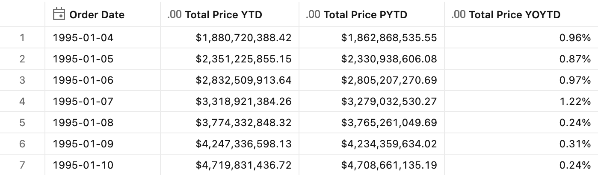
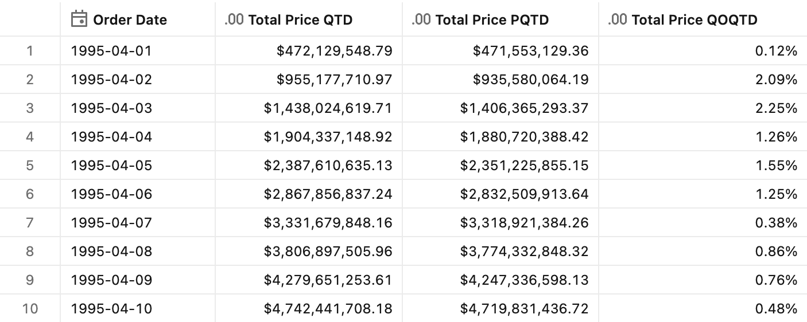
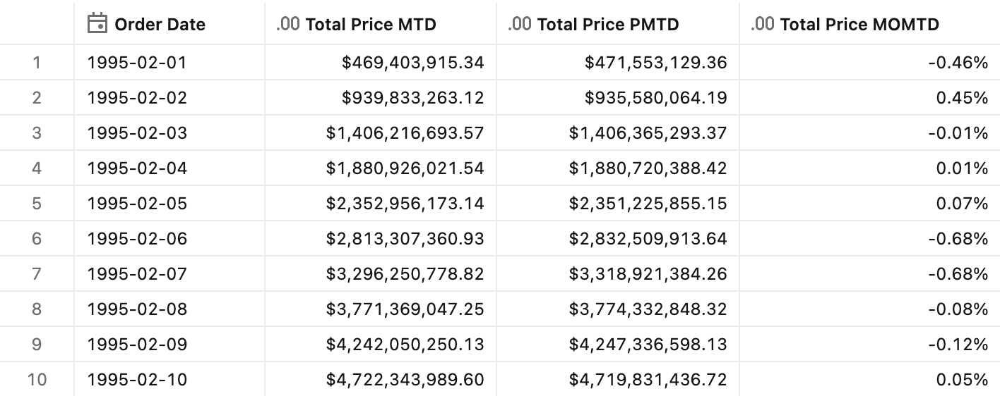
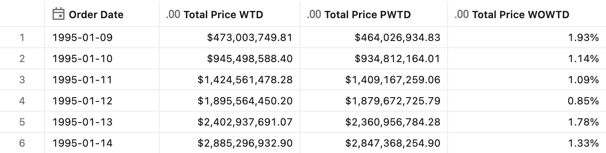

# Period-to-date growth

## Introduction

Period-to-date growth compares cumulative totals within a period to the same point in a prior period. Unlike simple period-over-period growth (which compares complete periods), period-to-date growth enables **fair comparisons** for incomplete periods. For example, comparing August 15th's year-to-date sales to August 15th of the previous year (not to the full previous year) provides an accurate measure of performance at the same point in time.

This pattern is essential for mid-period reporting: executives asking "How are we tracking vs. last year?" on any given day need YOYTD (year-over-year-to-date) rather than YoY, which would compare incomplete current data to a full prior period.

In Unity Catalog metric views, period-to-date growth combines two techniques:
1. **Cumulative windows** with dual `order` specifications (from period-to-date totals)
2. **Period offset** applied to **both** windows to shift the comparison frame backward

## The fair comparison principle

Period-to-date growth ensures apples-to-apples comparisons by matching the relative position within each period:

| Date | What We Compare | Fair Comparison |
|------|-----------------|-----------------|
| Aug 15, 2024 | YTD (Jan 1 - Aug 15, 2024) | PYTD (Jan 1 - Aug 15, 2023) |
| May 15, Q2 | QTD (Apr 1 - May 15) | PQTD (Jan 1 - Feb 15, Q1) |
| Day 10 of month | MTD (Day 1 - Day 10) | PMTD (Day 1 - Day 10, prior month) |

This prevents the misleading growth rates that occur when comparing partial periods to complete ones.

## Key implementation detail

To achieve fair comparison in Unity Catalog metric views, the `offset` must be applied to **both** window specifications:

```yaml
window:
  - order: OrderDate        # Cumulative ordering
    range: cumulative
    semiadditive: last
    offset: -1 month        # ← Offset on cumulative window
  - order: Month            # Period boundary
    range: current
    semiadditive: last
    offset: -1 month        # ← Offset on period window
```

This shifts the entire cumulative frame backward, ensuring that Feb 10 PMTD returns the cumulative sum through Jan 10 (not the full January total).


## Preparation

1. Ensure that you have created the test dataset using the [tpc-h.sql](/tpc-h.sql) script.

2. Create the basic metric view definition.
    <details>
    <summary>Basic metric view definition</summary>

    ```yaml
    version: 1.1
    comment: Unity Catalog semantics patterns

    source: orders

    joins:
      - name: customer
        source: customer
        'on': source.o_custkey = customer.c_custkey
        rely:
          at_most_one_match: true
        joins:
            - name: nation
              source: nation
              'on': customer.c_nationkey = nation.n_nationkey
              rely:
                at_most_one_match: true
              joins:
                - name: region
                  source: region
                  'on': nation.n_regionkey = region.r_regionkey
                  rely:
                    at_most_one_match: true

    fields:
      - name: RegionName
        display_name: Region Name
        expr: customer.nation.region.r_name

      - name: CountryName
        display_name: Country Name
        expr: customer.nation.n_name

      - name: CustomerName
        display_name: Customer Name
        expr: customer.c_name

      - name: MarketSegment
        display_name: Market Segment
        expr: customer.c_mktsegment

      - name: OrderDate
        display_name: Order Date
        expr: o_orderdate

      - name: Year
        display_name: Order Year
        expr: DATE_TRUNC('year', o_orderdate)
        format: 
          type: date
          date_format: year_month_day
          leading_zeros: true

      - name: Month
        display_name: Order Month
        expr: DATE_TRUNC('month', o_orderdate)
        format: 
          type: date
          date_format: year_month_day
          leading_zeros: true      

      - name: Quarter
        display_name: Order Quarter
        expr: DATE_TRUNC('quarter', o_orderdate)
        format: 
          type: date
          date_format: year_month_day
          leading_zeros: true

      - name: Week
        display_name: Order Week
        expr: DATE_TRUNC('week', o_orderdate)
        format: 
          type: date
          date_format: year_month_day
          leading_zeros: true

      - name: OrderPriority
        display_name: Order Priority
        expr: o_orderpriority

      - name: ShipPriority
        display_name: Ship Priority
        expr: o_shippriority

    measures:
      - name: TotalPrice
        display_name: Total Price
        expr: SUM(o_totalprice)
        format:
          type: currency
          currency_code: USD
          decimal_places:
            type: exact
            places: 2
          hide_group_separator: false
          abbreviation: none
    ```

    </details>


## Year-over-year-to-date growth (YOYTD)

**Sample question** - *How are our year-to-date sales tracking compared to this point last year?*

### Measure definition

```yaml
- name: TotalPrice_YTD
  display_name: Total Price YTD
  comment: 'Year-to-date total: cumulative sum from start of year to current date'
  expr: TotalPrice
  window:
    - order: OrderDate
      range: cumulative
      semiadditive: last
    - order: Year
      range: current
      semiadditive: last
  format:
    type: currency
    currency_code: USD
    decimal_places:
      type: exact
      places: 2
    hide_group_separator: false
    abbreviation: none

- name: TotalPrice_PYTD
  display_name: Total Price PYTD
  comment: 'Previous year-to-date: cumulative sum to same relative date in prior year'
  expr: TotalPrice
  window:
    - order: OrderDate
      range: cumulative
      semiadditive: last
      offset: -1 year
    - order: Year
      range: current
      semiadditive: last
      offset: -1 year
  format:
    type: currency
    currency_code: USD
    decimal_places:
      type: exact
      places: 2
    hide_group_separator: false
    abbreviation: none

- name: TotalPrice_YOYTD
  display_name: Total Price YOYTD
  comment: Year-over-year-to-date growth rate
  expr: (AGG(TotalPrice_YTD) - AGG(TotalPrice_PYTD)) / AGG(TotalPrice_PYTD)
  format:
    type: percentage
    decimal_places:
      type: exact
      places: 2
```

### Test query

```sql
SELECT
    OrderDate,
    AGG(TotalPrice_YTD),
    AGG(TotalPrice_PYTD),
    AGG(TotalPrice_YOYTD)
FROM mv_PeriodToDateGrowth
WHERE OrderDate BETWEEN '1995-01-04' AND '1995-01-10'
GROUP BY ALL
ORDER BY OrderDate
```

<details>
<summary>Test query output</summary>



</details>


## Quarter-over-quarter-to-date growth (QOQTD)

**Sample question** - *How are our quarter-to-date sales tracking compared to this point last quarter?*

### Measure definition

```yaml
- name: TotalPrice_QTD
  display_name: Total Price QTD
  comment: 'Quarter-to-date total: cumulative sum from start of quarter to current date'
  expr: TotalPrice
  window:
    - order: OrderDate
      range: cumulative
      semiadditive: last
    - order: Quarter
      range: current
      semiadditive: last
  format:
    type: currency
    currency_code: USD
    decimal_places:
      type: exact
      places: 2
    hide_group_separator: false
    abbreviation: none

- name: TotalPrice_PQTD
  display_name: Total Price PQTD
  comment: 'Previous quarter-to-date: cumulative sum to same relative date in prior quarter'
  expr: TotalPrice
  window:
    - order: OrderDate
      range: cumulative
      semiadditive: last
      offset: -3 months
    - order: Quarter
      range: current
      semiadditive: last
      offset: -3 months
  format:
    type: currency
    currency_code: USD
    decimal_places:
      type: exact
      places: 2
    hide_group_separator: false
    abbreviation: none

- name: TotalPrice_QOQTD
  display_name: Total Price QOQTD
  comment: Quarter-over-quarter-to-date growth rate
  expr: (AGG(TotalPrice_QTD) - AGG(TotalPrice_PQTD)) / AGG(TotalPrice_PQTD)
  format:
    type: percentage
    decimal_places:
      type: exact
      places: 2
```

### Test query

```sql
SELECT
    OrderDate,
    AGG(TotalPrice_QTD),
    AGG(TotalPrice_PQTD),
    AGG(TotalPrice_QOQTD)
FROM mv_PeriodToDateGrowth
WHERE OrderDate BETWEEN '1995-04-01' AND '1995-04-10'
GROUP BY ALL
ORDER BY OrderDate
```

<details>
<summary>Test query output</summary>



</details>


## Month-over-month-to-date growth (MOMTD)

**Sample question** - *How are our month-to-date sales tracking compared to this point last month?*

### Measure definition

```yaml
- name: TotalPrice_MTD
  display_name: Total Price MTD
  comment: 'Month-to-date total: cumulative sum from start of month to current date'
  expr: TotalPrice
  window:
    - order: OrderDate
      range: cumulative
      semiadditive: last
    - order: Month
      range: current
      semiadditive: last
  format:
    type: currency
    currency_code: USD
    decimal_places:
      type: exact
      places: 2
    hide_group_separator: false
    abbreviation: none

- name: TotalPrice_PMTD
  display_name: Total Price PMTD
  comment: 'Previous month-to-date: cumulative sum to same relative date in prior month'
  expr: TotalPrice
  window:
    - order: OrderDate
      range: cumulative
      semiadditive: last
      offset: -1 month
    - order: Month
      range: current
      semiadditive: last
      offset: -1 month
  format:
    type: currency
    currency_code: USD
    decimal_places:
      type: exact
      places: 2
    hide_group_separator: false
    abbreviation: none

- name: TotalPrice_MOMTD
  display_name: Total Price MOMTD
  comment: Month-over-month-to-date growth rate
  expr: (AGG(TotalPrice_MTD) - AGG(TotalPrice_PMTD)) / AGG(TotalPrice_PMTD)
  format:
    type: percentage
    decimal_places:
      type: exact
      places: 2
```

### Test query

```sql
SELECT
    OrderDate,
    AGG(TotalPrice_MTD),
    AGG(TotalPrice_PMTD),
    AGG(TotalPrice_MOMTD)
FROM mv_PeriodToDateGrowth
WHERE OrderDate BETWEEN '1995-02-01' AND '1995-02-10'
GROUP BY ALL
ORDER BY OrderDate
```

<details>
<summary>Test query output</summary>



</details>


## Week-over-week-to-date growth (WOWTD)

**Sample question** - *How are our week-to-date sales tracking compared to this point last week?*

### Measure definition

```yaml
- name: TotalPrice_WTD
  display_name: Total Price WTD
  comment: 'Week-to-date total: cumulative sum from start of week to current date'
  expr: TotalPrice
  window:
    - order: OrderDate
      range: cumulative
      semiadditive: last
    - order: Week
      range: current
      semiadditive: last
  format:
    type: currency
    currency_code: USD
    decimal_places:
      type: exact
      places: 2
    hide_group_separator: false
    abbreviation: none

- name: TotalPrice_PWTD
  display_name: Total Price PWTD
  comment: 'Previous week-to-date: cumulative sum to same relative date in prior week'
  expr: TotalPrice
  window:
    - order: OrderDate
      range: cumulative
      semiadditive: last
      offset: -7 days
    - order: Week
      range: current
      semiadditive: last
      offset: -7 days
  format:
    type: currency
    currency_code: USD
    decimal_places:
      type: exact
      places: 2
    hide_group_separator: false
    abbreviation: none

- name: TotalPrice_WOWTD
  display_name: Total Price WOWTD
  comment: Week-over-week-to-date growth rate
  expr: (AGG(TotalPrice_WTD) - AGG(TotalPrice_PWTD)) / AGG(TotalPrice_PWTD)
  format:
    type: percentage
    decimal_places:
      type: exact
      places: 2
```

### Test query

```sql
SELECT
    OrderDate,
    AGG(TotalPrice_WTD),
    AGG(TotalPrice_PWTD),
    AGG(TotalPrice_WOWTD)
FROM mv_PeriodToDateGrowth
WHERE OrderDate BETWEEN '1995-01-09' AND '1995-01-14'
GROUP BY ALL
ORDER BY OrderDate
```

<details>
<summary>Test query output</summary>



</details>


## Edge cases and considerations

### Date alignment across months

When comparing PMTD, dates are matched by their position within each month. For example:
- Feb 15 PMTD compares to Jan 15 MTD
- Feb 28 PMTD compares to Jan 28 MTD (not Jan 31)

This ensures a fair comparison based on the same number of days into each month.

### First period in dataset

For the first year/quarter/month in the dataset:
- PYTD/PQTD/PMTD will return NULL (no prior period exists)
- Growth rate calculations will also return NULL

This is expected behavior — there is no meaningful comparison for the first period.

### Leap year considerations

Databricks uses **conservative clipping** for date offsets:

| Scenario        | Input        | Offset    | Result                                 |
|-----------------|--------------|-----------|----------------------------------------|
| Leap → Non-leap | `1996-02-29` | `-1 year` | `1995-02-28` (clips to last valid day) |
| Non-leap → Leap | `1995-02-28` | `+1 year` | `1996-02-28` (stays at 28, not 29)     |

**Implications for PYTD:**
- Feb 29, 2024 PYTD compares to Feb 28, 2023 (prior year has no Feb 29)
- Feb 28, 2023 PYTD compares to Feb 28, 2022 (not Feb 29, even if 2022 were a leap year)

This ensures consistent day-of-month matching where possible, with clipping only when the target month is shorter.


## End-to-end template

The end-to-end reference implementation can be found in the [Period-to-date growth](./Period-to-date%20growth.yml) YAML file.
