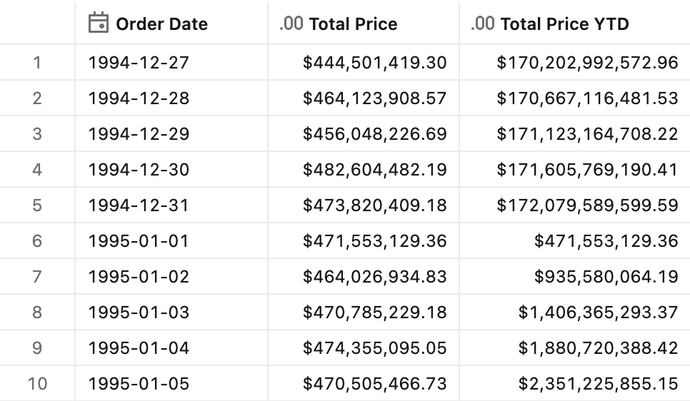
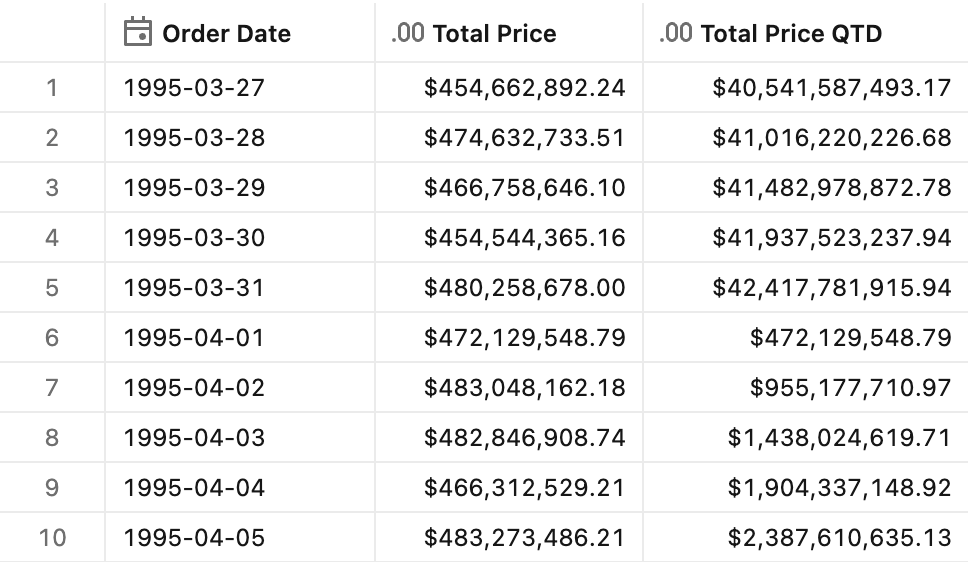
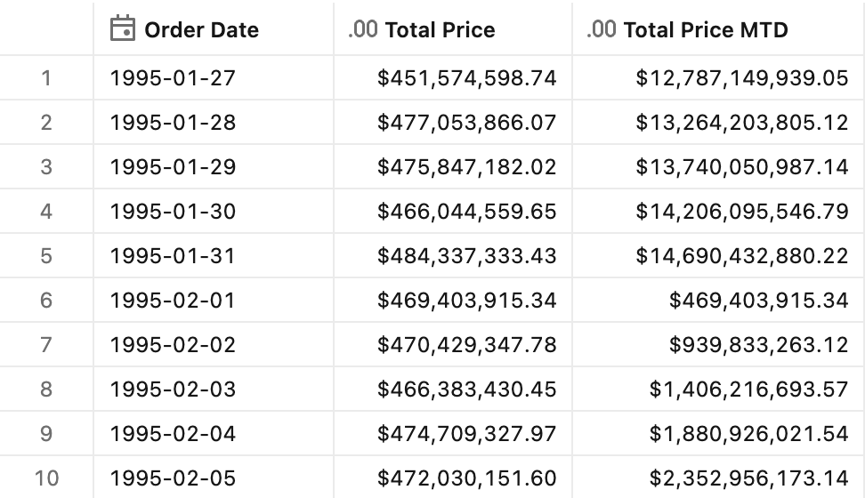

# Period-to-date totals

## Introduction

A "period-to-date total" adds up activity from the start of a period up to today — like "total sales this year so far" (year-to-date). It matters because it shows real progress against a meaningful boundary: the week, month, quarter, or year. Leaders use it to track pace toward targets, compare against the same point last period, and see whether they're on track to hit goals.


## Preparation

1. Ensure that you have created the test dataset using the [tpc-h.sql](/tpc-h.sql) script.

2. Create the basic metric view definition.
    <details>
    <summary>Basic metric view definition</summary>

    ```yaml
    version: 1.1
    comment: Unity Catalog semantics patterns

    source: orders

    joins:
      - name: customer
        source: customer
        'on': source.o_custkey = customer.c_custkey
        rely:
          at_most_one_match: true
        joins:
            - name: nation
              source: nation
              'on': customer.c_nationkey = nation.n_nationkey
              rely:
                at_most_one_match: true
              joins:
                - name: region
                  source: region
                  'on': nation.n_regionkey = region.r_regionkey
                  rely:
                    at_most_one_match: true

    fields:
      - name: RegionName
        display_name: Region Name
        expr: customer.nation.region.r_name

      - name: CountryName
        display_name: Country Name
        expr: customer.nation.n_name

      - name: CustomerName
        display_name: Customer Name
        expr: customer.c_name

      - name: MarketSegment
        display_name: Market Segment
        expr: customer.c_mktsegment

      - name: OrderDate
        display_name: Order Date
        expr: o_orderdate
        format: 
          type: date
          date_format: year_month_day
          leading_zeros: true  

      - name: Year
        display_name: Order Year
        expr: DATE_TRUNC('year', o_orderdate)
        format: 
          type: date
          date_format: year_month_day
          leading_zeros: true  

      - name: Month
        display_name: Order Month
        expr: DATE_TRUNC('month', o_orderdate)
        format: 
          type: date
          date_format: year_month_day
          leading_zeros: true  

      - name: Quarter
        display_name: Order Quarter
        expr: DATE_TRUNC('quarter', o_orderdate)
        format: 
          type: date
          date_format: year_month_day
          leading_zeros: true  

      - name: OrderPriority
        display_name: Order Priority
        expr: o_orderpriority

      - name: ShipPriority
        display_name: Ship Priority
        expr: o_shippriority

    measures:
      - name: TotalPrice
        display_name: Total Price
        comment: Total Prices across all orders in the period
        expr: SUM(o_totalprice)
        format:
          type: currency
          currency_code: USD
          decimal_places:
            type: exact
            places: 2
          hide_group_separator: false
          abbreviation: none
    ```

    </details>


## Year-to-date total

**Sample question** - *What are the total sales since the beginning of the year?*

### Measure definition

```yaml
- name: TotalPrice_YTD
  display_name: Total Price YTD
  comment: Total Price - Year-to-Date
  expr: TotalPrice
  window:
    - order: OrderDate
      range: cumulative
      semiadditive: last
    - order: Year
      range: current
      semiadditive: last
  format:
    type: currency
    currency_code: USD
    decimal_places:
      type: exact
      places: 2
    hide_group_separator: false
    abbreviation: none
```

### Test query

```sql
SELECT OrderDate, AGG(TotalPrice), AGG(TotalPrice_YTD)
FROM mv_PeriodToDateTotals
WHERE OrderDate BETWEEN '1994-12-27' AND '1995-01-05'
GROUP BY ALL
ORDER BY OrderDate
```

<details>
<summary>Test query output</summary>



</details>


## Quarter-to-date total

**Sample question** - *What are the total sales since the beginning of the quarter?*

### Measure definition

```yaml
- name: TotalPrice_QTD
  display_name: Total Price QTD
  comment: Total Price - Quarter-to-Date
  expr: TotalPrice
  window:
    - order: OrderDate
      range: cumulative
      semiadditive: last
    - order: Quarter
      range: current
      semiadditive: last
  format:
    type: currency
    currency_code: USD
    decimal_places:
      type: exact
      places: 2
    hide_group_separator: false
    abbreviation: none
```

### Test query

```sql
SELECT OrderDate, AGG(TotalPrice), AGG(TotalPrice_QTD)
FROM mv_PeriodToDateTotals
WHERE OrderDate BETWEEN '1995-03-27' AND '1995-04-05'
GROUP BY ALL
ORDER BY OrderDate
```

<details>
<summary>Test query output</summary>



</details>


## Month-to-date total

**Sample question** - *What are the total sales since the beginning of the month?*

### Measure definition

```yaml
- name: TotalPrice_MTD
  display_name: Total Price MTD
  comment: Total Price - Month-to-Date
  expr: TotalPrice
  window:
    - order: OrderDate
      range: cumulative
      semiadditive: last
    - order: Month
      range: current
      semiadditive: last
  format:
    type: currency
    currency_code: USD
    decimal_places:
      type: exact
      places: 2
    hide_group_separator: false
    abbreviation: none
```

### Test query

```sql
SELECT OrderDate, AGG(TotalPrice), AGG(TotalPrice_MTD)
FROM mv_PeriodToDateTotals
WHERE OrderDate BETWEEN '1995-01-27' AND '1995-02-05'
GROUP BY ALL
ORDER BY OrderDate
```

<details>
<summary>Test query output</summary>



</details>


## End-to-end template

The end-to-end reference implementation can be found in the [Period-to-date totals](./Period-to-date%20totals.yml) YAML file.
